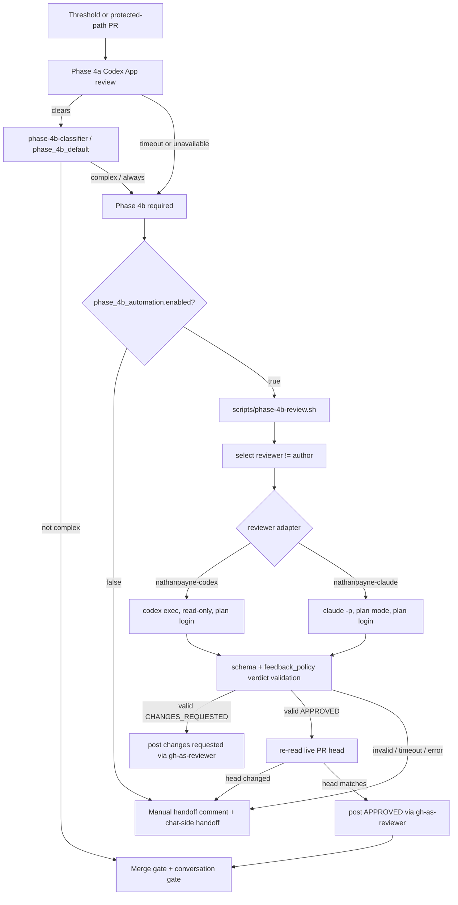

<!--
generated_by: scripts/project-doc-sync.sh
do_not_edit: true
source_repo: nathanjohnpayne/docs
source_path: projects/mergepath/prds/mergepath.md
source_ref: a219367
project: mergepath
document_class: prd
document_slug: mergepath
sync_direction: central-to-repo
-->

---
tags:
  - mergepath
  - prd
  - ai-agents
  - infrastructure
  - ci-cd
---
# Product Requirements Document: Mergepath

**Author:** Nathan Payne
**Status:** Approved — living document
**Last Updated:** 2026-07-01

---

## Executive Summary

**Mergepath** (originally `ai_agent_repo_template`) solves a critical infrastructure problem: **configuration drift and inconsistency across multiple AI coding agents** (Claude, Cursor, Codex, etc.) and development tools. When multiple AI agents work in the same repository, they often apply conflicting instructions, fork documentation, and operate under different rules—leading to confusion, missed governance checks, and a fragmented developer experience.

This template provides a **deterministic repository standard** that keeps humans and AI agents aligned through:

1. **Canonical documentation** that is the single source of truth
2. **Binding structural constraints** enforced via CI
3. **Multi-identity code review**, allowing agents to author and self-review under separate GitHub accounts, with a two-phase external-review model (Phase 4a automated via the Codex GitHub App, Phase 4b local reviewer-CLI handoff with manual fallback) and a HEAD-pinned merge-clearance gate that re-evaluates clearance on every push so a stale, earlier-HEAD approval can never carry a merge (#427/#428)
4. **Drift prevention architecture** that consolidates instructions and prevents duplication
5. **1Password-backed deploy and runtime secret handling** using per-project Firebase-vault SA keys for deploys, scoped service-account tokens for approved headless review workflows, and a portable 1Password Environments core with per-client agent adapters
6. **Machine bootstrap automation** for onboarding new machines without storing secrets in git
7. **Cross-repo propagation** (`scripts/sync-to-downstream.sh`) that mirrors canonical, kit, and templated template changes into every downstream consumer through the full review flow — including a `--sync-all` steady-state reconcile and a per-repo `.sync-overrides.yml` divergence registry
8. **New-repo bootstrap wizard** (`scripts/bootstrap-new-repo.sh`) that stands up a brand-new repo from the template end to end — template mirror, name substitution, GitHub repo creation, labels, reviewer collaborators, secrets, Firebase/CodeRabbit/Codex posture, and the Project v2 board

The template is both a reference implementation and a structural enforcer, designed to be adopted incrementally into new and existing repositories — and, increasingly, to keep that adoption *current* automatically rather than relying on manual re-sync.

---

## Table of Contents

1. [Problem Statement](#problem-statement)
2. [Solution Overview](#solution-overview)
3. [Repository Map](#repository-map)
4. [Agent Instruction Architecture](#agent-instruction-architecture)
5. [CI Enforcement Model](#ci-enforcement-model)
6. [Drift Prevention Philosophy](#drift-prevention-philosophy)
7. [Code Review and Identity System](#code-review-and-identity-system)
8. [Bootstrap and Secrets Management](#bootstrap-and-secrets-management)
9. [Adoption Guide](#adoption-guide)
10. [Key Design Decisions](#key-design-decisions)

---

## Problem Statement

### The Configuration Drift Problem

When multiple AI coding agents operate in the same repository, each typically reads its own configuration:

- **Cursor** reads from `.cursor/rules.json`
- **Claude Code** reads from `.claude/config.json`
- **VS Code** reads from `.vscode/settings.json`
- Each may have its own behavioral instructions embedded in editor configs or tool-specific files

This fragmentation creates **configuration drift**: instructions diverge, behavioral rules conflict, and agents make decisions based on incomplete or contradictory information. The result is:

- Inconsistent code style and patterns
- Duplicate or conflicting documentation
- Missed governance checks (a rule in one tool folder might not exist in another)
- Confused agents that don't know which instruction to follow when they conflict
- Governance rules that rot over time as repos evolve but tool-specific configs don't update

### The Human-Agent Alignment Problem

Developers also struggle to communicate intent consistently:

- Instructions are scattered across multiple files with no clear hierarchy
- Tool folders duplicate canonical docs, making updates error-prone
- It's unclear which instruction takes precedence when conflicts arise
- Onboarding a new agent requires hunting through multiple locations
- "Canonical" docs sometimes aren't canonical—a tool folder instruction contradicts AGENTS.md, and no one knows which is binding

### The Governance and Review Problem

AI agents authoring code need consistent review processes, but GitHub's native model assumes human reviewers. Supporting multiple agents authoring code under a shared identity while maintaining audit trails and enforcing review policies requires:

- A way to identify which agent authored a PR when all commit under the same GitHub account
- A way for agents to perform self-review under their own identities without approving their own code
- A way to escalate complex changes to different agents for external review
- Automated enforcement of review thresholds and protected paths
- Clear identity management so the human can act as a tiebreaker

### The Deploy and Runtime Secret Problem

Firebase and GCP deployments should be non-interactive for humans and fully automated for CI, while runtime application secrets should be available to attended agents without being pasted into prompts, committed to disk, or broadly exposed. Most templates default to:

- Long-lived service account keys committed to git (security risk)
- Interactive `firebase login` or `gcloud auth login` for every deployment
- Secrets stored in environment variables or files
- No clear way for headless environments (scheduled tasks, cloud automations) to authenticate without interactive 1Password biometric prompts
- No clear compatibility model for different agent clients: a Codex-specific 1Password adapter is not the same thing as universal MCP support

---

## Solution Overview

**Mergepath** addresses these problems through:

### 1. Canonical Documentation Architecture

A strict hierarchy ensures no ambiguity:

```
README.md (entry point)
├── AGENTS.md (index to agent behavior)
│   ├── docs/agents/repository-overview.md
│   ├── docs/agents/operating-rules.md
│   ├── docs/agents/code-modification-rules.md
│   ├── docs/agents/documentation-rules.md
│   ├── docs/agents/testing-requirements.md
│   ├── docs/agents/deployment-process.md
│   └── docs/agents/code-review-requirements.md
├── rules/repo_rules.md (binding constraints)
├── REVIEW_POLICY.md (AI review policy)
├── DEPLOYMENT.md (deploy and credential setup)
├── CONTRIBUTING.md (contribution workflow)
├── BRAND.md (Mergepath surface vocabulary)
├── SECURITY.md (vulnerability reporting baseline)
└── .ai_context.md (supplemental context)
```

Tool folders (`.cursor/`, `.claude/`, `.vscode/`) may contain configuration and references to canonical docs, but must not contain repo-specific behavioral rules that duplicate `AGENTS.md` or `docs/agents/`. CI checks enforce this separation.

### 2. Binding Structural Constraints

`rules/repo_rules.md` defines invariants that agents must not violate:

- Required files must exist
- All changes must go through a pull request—never push directly to `main`
- Forbidden patterns are prohibited
- Tool folders may not contain instructions
- Generated files must never be edited manually
- Tests must not be deleted to force a passing build

### 3. Multi-Identity Code Review System

All agents author code as `nathanjohnpayne`, but each has a dedicated reviewer identity:

- **Claude** reviews as `nathanpayne-claude`
- **Cursor** reviews as `nathanpayne-cursor`
- **Codex** reviews as `nathanpayne-codex`

This allows:
- Agents to perform self-peer review by routing guarded writes through their reviewer identities
- Internal review (agent → agent) and external review (agent → different agent)
- Automated external review via CodeRabbit (advisory) and the ChatGPT Codex Connector GitHub App (Phase 4a)
- An automated local CLI handoff for Phase 4b that runs reviewer CLIs on individual subscription plans, posts through the verified reviewer wrapper, and falls back to the manual handoff on any doubt
- Complete audit trails indistinguishable from multi-developer collaboration
- Human tiebreaking when agents disagree

The write-identity convention is enforced by tooling: `scripts/gh-as-author.sh` and `scripts/gh-as-reviewer.sh` wrap guarded GitHub writes, resolve the expected token, verify the effective login, and run the command with process-local `GH_TOKEN`. The `gh-pr-guard.sh` PreToolUse hook blocks bare or inline-token guarded writes that bypass those wrappers. This closes the attribution footgun where a PR create, review, comment, edit, or merge could otherwise land under the wrong identity.

#### Merge-Clearance Gate (HEAD-pinned)

Review clearance is also enforced as a required, HEAD-pinned status check, not only through removable labels. `scripts/merge-clearance-gate.sh` (run by `.github/workflows/merge-clearance-gate.yml` as the required check `Merge Clearance Gate / Merge clearance gate`) re-evaluates clearance on the *current* HEAD every push and blocks merge unless it holds there. It reuses `scripts/codex-review-check.sh`'s gate (b) reviewer-`APPROVED` and gate (c) Codex / Phase-4b predicate, and covers two escapes that label-only enforcement allowed:

- **External-review gate (`codex.external_review_gate`, #428):** a PR carrying `needs-external-review` cannot merge on a HEAD that lacks an `APPROVED` CLI review and a Codex clearance signal. The removable `needs-external-review` label plus `auto-clear-blocking-labels.yml` remain the UX layer; the merge-blocking truth moves to this HEAD-pinned check, which a stale earlier-HEAD clearance cannot satisfy.
- **Dependabot reviewer gate (`dependabot.reviewer_gate`, #427):** a Dependabot PR cannot merge unless a reviewer identity (≠ the author) has a latest-state `APPROVED` review whose `commit_id` equals the current HEAD — closing the case where a rebase push silently dismissed the prior approval and the PR merged with none on record.

Both gates follow the same narrow-start posture as `codex.p1_gate`: enabled in Mergepath first, then propagated to consumers.

#### Automated Phase 4b Review Handoff

Phase 4b no longer has to mean a human manually shuttles a diff between agent
sessions. Mergepath defines an automated, local-only handoff path that can run
the same external-agent review through the operator's installed reviewer CLIs:

- A protected-path or above-threshold PR reaches Phase 4b after Phase 4a
  fallback, escalation, or proactive `phase_4b_default` routing.
- `scripts/phase-4b-review.sh` selects a reviewer identity that differs from
  the PR's `Authoring-Agent:` line, invokes the matching local adapter, validates
  the structured verdict, re-reads the live PR head, and posts the review through
  `scripts/gh-as-reviewer.sh`.
- `scripts/phase-4b/adapters/review-via-codex.sh` covers Claude-authored PRs by
  running `codex exec --sandbox read-only --output-schema ...`; the Claude
  direction uses `claude -p --permission-mode plan --output-format json`.
- The adapters scrub pay-per-token API key variables and GitHub token variables
  before launching the reviewer CLI. Reasoning runs on the operator's individual
  Codex/ChatGPT or Claude Code plan login, never on metered API credentials, and
  the reviewer CLI never receives direct GitHub write authority.
- The orchestrator posts `APPROVED` or `CHANGES_REQUESTED` only after schema and
  semantic validation. `APPROVED` cannot carry findings whose severity is
  required by `feedback_policy` (#574): absent policy means P0/P1 block approval;
  `mode: address-all` means any finding blocks automated approval.
- Any adapter error, timeout, invalid verdict, unsupported reviewer, stale-head
  readback, or disabled config exits fail-closed to the manual Phase 4b handoff.

The shipped posture is disabled-by-default. Merging the automation package
changes no live review behavior until a small follow-up PR flips
`phase_4b_automation.enabled: true` in `.github/review-policy.yml`.



Live validation on PR #580 exercised the feature on a large, protected-path PR
before enabling it. The final current-head pass (`d05ff4d`) produced:

| Path | Outcome | Turnaround | Token metadata |
|---|---:|---:|---:|
| Codex adapter, direct | `APPROVED` | 18s | `token_count=55926` |
| Codex adapter via orchestrator dry-run | `APPROVED`; would post as `nathanpayne-codex` | 65s | `token_count=113918` |
| Claude adapter, direct | `APPROVED` with advisory follow-ups filed separately | 66s | `total=7360` (`input=1589`, `output=5771`) |
| Claude reverse-direction orchestrator dry-run | Fail-closed because approval carried findings | 76s | CLI-dependent |

The same exchange also captured the operational turnaround for a real large PR:
from the first PR automation comment on 2026-07-01 00:20:33 UTC to squash merge
on 2026-07-01 06:12:52 UTC, PR #580 took about 5h52m wall time. That window
included CodeRabbit, Claude, and Codex review rounds; real CLI adapter
validation; branch fixes for P1 and advisory findings; post-review issue filing;
review-thread cleanup; auto-clearing `needs-external-review`; and merge through
the author wrapper. The PR evidence comments remain the durable record for the
raw adapter verdicts, token metadata when exposed by the CLIs, and dry-run
posting behavior.

### 4. CI Enforcement of Standards

A large suite of validation checks (48 `scripts/ci/check_*` scripts as of v1.5, all wired or intentionally `WIRED-EXEMPT`, plus two inline steps) runs on every commit via `repo_lint.yml`. A meta-check, `check_ci_scripts_wired`, fails the build if any `scripts/ci/check_*` script on disk is not wired into `repo_lint.yml` as an explicit `run:` step (or carries a documented `# WIRED-EXEMPT` comment), so the on-disk list and the executable list cannot silently diverge. The structural core:

- `check_required_root_files` — all canonical docs exist
- `check_no_tool_folder_instructions` — tool folders contain no duplicated behavioral rules
- `check_no_forbidden_top_level_dirs` — no forbidden top-level directories (repos may declare extra allowed dirs in `.repo-template.yml`)
- `check_dist_not_modified` — generated files are never edited manually
- `check_spec_test_alignment` — specs have corresponding tests (matched by `spec_id` frontmatter, `tests:` mapping, or filename convention)
- `check_duplicate_docs` — no instruction duplication

`repo_lint.yml` also includes two inline (non-`scripts/ci`) steps: `check_review_policy_exists`, which verifies `.github/review-policy.yml` and `REVIEW_POLICY.md` both exist, and `check_governance_files`, which verifies `SECURITY.md`, `.github/CODEOWNERS`, and `.github/dependabot.yml` all exist.

Plus the review/automation surface checks: `check_codex_scripts`, `check_codex_p1_gate`, `check_merge_clearance_gate`, `check_gh_as_author`, `check_no_bare_gh_writes`, `check_disagreement_detector`, `check_pr_audit_codex_clearance`, `check_pr_audit_sync_exemption`, `check_resolve_pr_threads`, `check_phase_4b_classifier`, `check_phase_4b_automation`, `check_op_preflight_contract`, `check_onepassword_headless_proof_workflow`, `check_daily_feedback_rollup`, `check_workflow_parsers`, `check_auto_clear_workflow`, `check_session_finalization`, `check_coderabbit_config` / `check_coderabbit_config_tests` / `check_coderabbit_wait`, `check_eslint_config_present` / `check_eslint_config_policy`, and `check_mktemp_portability`; the sync/propagation checks `check_sync_manifest`, `check_sync_overrides`, `check_sync_to_downstream`, `check_verify_propagation_pr`, `check_workflow_verify_propagation_templated`, `check_propagation_lane_audit`, `check_template_substitution`, `check_export_consumer_facts`, and `check_sweep_unresolved_feedback`; the bootstrap suite (`check_bootstrap_sh`, `check_bootstrap_wizard`, `check_bootstrap_template_mirror`, `check_bootstrap_github_infra`, `check_bootstrap_firebase_and_codereview`, `check_bootstrap_board_and_summary`); and regression-pinning checks named for the bug class they preserve (`check_canonical_bugs_*`). `check_op_firebase_deploy_integration` ships on disk but is intentionally `WIRED-EXEMPT` — an opt-in, local-only resolver smoke test gated on `MERGEPATH_RUN_INTEGRATION=1`. Each script-backed `scripts/ci/check_*` wrapper is fail-closed around a `tests/test_*.sh` suite; a missing test script is a hard error, not a silent skip. `.github/workflows/repo_lint.yml` is the executable source of truth for which checks run; `rules/repo_rules.md` § CI Enforcement and `scripts/ci/README.md` summarize them and must be kept in lockstep with it.

### Source of Truth and Versioning

This PRD defines policy. The `mergepath` repository is the reference implementation. If any mismatch exists between the PRD and Mergepath, the discrepancy must be resolved in the same change that surfaces it — neither document silently overrides the other.

### Project Documentation Sync Contract

Mergepath standardizes project documentation around a central project registry in
`nathanjohnpayne/docs` and generated mirrors inside the owning repositories. The
goal is complete project context in `docs/projects/` while preserving a single
editable source for each document class.

The normalized central layout is:

```text
docs/
  projects/
    <project-slug>/
      README.md
      manifest.yml
      prds/
        <prd-slug>.md
      specs/
        <spec-slug>.md
      docs/
        architecture/
        decisions/
        runbooks/
        design/
      plans/
      archive/
```

An owning repository is the source-of-truth home for a project's implementation
code and authoritative specs. It is distinct from downstream consumer repos:
consumers receive propagated Mergepath template surfaces, while owning repos
author and test project-specific implementation contracts.

Operationally, project-doc sync is declared in `.mergepath-project-docs.yml`, a
companion manifest separate from `.mergepath-sync.yml`. The existing
`.mergepath-sync.yml` system continues to govern canonical, kit, and templated
Mergepath propagation to downstream consumers; `.mergepath-project-docs.yml`
governs cross-repo PRD/spec mirrors between `nathanjohnpayne/docs` and each
owning repo. The `scripts/project-doc-sync.sh` engine reads this manifest to
materialize each generated mirror and stamps it with a `generated_by` /
`source_repo` / `source_path` / `source_ref` provenance header.

The normalized owning-repo layout is:

```text
<repo>/
  specs/                         # authoritative implementation specs
  docs/agents/                   # Mergepath agent instructions
  docs/architecture/             # repo-local technical docs
  docs/projects/<project>/prds/  # generated PRD mirror from docs repo
```

Source-of-truth rules:

- PRDs are authored in `nathanjohnpayne/docs/projects/<project>/prds/`.
- Repo-local `docs/projects/<project>/prds/` files are generated mirrors. They
  carry a prominent header naming the source repo, source path, source ref, and
  "do not edit directly" status.
- Implementation specs are authored in each owning repo's top-level `specs/`
  directory because those specs are tested and reviewed with the code they
  govern.
- Central `docs/projects/<project>/specs/` files are generated mirrors of the
  owning repo's `specs/` files, so the central project folder remains complete
  without becoming a second implementation-spec edit path.
- `docs/projects/<project>/manifest.yml` records the project slug, owning repo,
  PRD sources, spec sources, mirror destinations, source refs, sync direction,
  and any documented exceptions.
- Repository `docs/` folders remain for repo-local architecture, runbooks,
  design notes, and agent instructions. They are not a catch-all home for PRDs
  or implementation specs; project PRDs and specs use the normalized
  `docs/projects/<project>/` sync paths.

Sync direction is therefore deliberate and asymmetric: PRDs flow
`docs/projects` -> owning repos, while implementation specs flow owning repos ->
`docs/projects`. Drift checks should report stale generated mirrors with the
source path and source ref, and local edits to generated mirrors must not become
authoritative silently.

Migration cleanup should standardize `prd/` to `prds/`, repair accidental names
such as duplicated `.md` suffixes, add missing central project folders for
onboarded repos, and move root-level PRD mirrors such as `mergepath.md` to the
project-scoped mirror convention instead of preserving root exceptions.

### 5. 1Password-Backed Deploy Auth

Deploy authentication uses a tiered credential resolution chain:

1. **Human-supplied `GOOGLE_APPLICATION_CREDENTIALS` override** — explicit debug/CI credential
2. **Project SA key from 1Password Firebase vault** — `op://Firebase/{project-id} — Firebase Deployer SA Key` (preferred day-to-day source for interactive and CI/headless deploys)
3. **Preflight-injected shared ADC tempfile** — from `scripts/op-preflight.sh --mode deploy|all`
4. **Shared 1Password-backed GCP ADC** — fallback when no project SA key is provisioned
5. **Local ADC file** — `~/.config/gcloud/application_default_credentials.json` (last resort)

When the source credential is a `service_account` key matching the target deployer SA, `op-firebase-deploy` uses it directly (no impersonation). Otherwise it wraps the credential in short-lived service account impersonation. Canonical scripts (`gcloud`, `op-firebase-deploy`, `op-firebase-setup`) are installed per-machine to `~/.local/bin/`.

The deploy wrapper also isolates Firebase CLI's configstore for the deploy subprocess. This prevents stale `firebase login` user-token state from overriding the selected Application Default Credential, closing the recurring daily `firebase login --reauth` failure that originally motivated #137/#154/#211.

### 6. Runtime 1Password Access Model

Mergepath's runtime secret guidance follows the accepted `docs/architecture/0001-onepassword-access-model.md` ADR:

- **Portable core:** 1Password Environments, `op://` secret references, `op run --environment <environment_id> -- <command>`, `op inject` for tools that require generated files, and scoped service-account tokens for approved headless workflows.
- **Attended Codex:** use the official 1Password Environments MCP Server for Codex when available.
- **Other attended agents:** Claude Code, Cursor, GitHub Copilot, and Windsurf should not be documented as using the Codex MCP server. Where a repo adopts mounted 1Password Environment files, use the 1Password local `.env` validation hook for supported clients.
- **Mergepath shell scripts:** keep shelling out to `op`; do not migrate `scripts/bootstrap.sh`, `scripts/op-preflight.sh`, or deploy helpers to a language SDK without a separate design decision.
- **CI/headless:** service-account tokens are explicit-only and scope-limited. The current approved proof path reads reviewer PAT refs plus a canary from a dedicated service-account-accessible vault; it excludes the author PAT, GCP ADC, Cloudflare tokens, deploy keys, and unrelated runtime secrets.

### 7. Machine Bootstrap Automation

The `bootstrap.sh` script restores local environment files without storing secrets in git:

- Templates (`.env.tpl`) contain `op://` references to 1Password items
- Running `./scripts/bootstrap.sh` resolves those references via `op inject`
- Output files (`.env.local`) are gitignored
- Supports `--force` to overwrite with freshly resolved values
- Fails closed on the retired Secure Note `notesPlain` whole-file bootstrap path; `--sync` and non-empty `BOOTSTRAP_FILES` are no longer supported

This enables seamless machine transitions: clone the repo on a new machine, run `bootstrap.sh`, secrets are automatically resolved from 1Password.

### 8. Cross-Repo Propagation

`scripts/sync-to-downstream.sh` propagates canonical, kit-directory, and templated template changes from Mergepath into every downstream consumer repo, opening one PR per consumer through the full Phase 4 review flow:

- A `.mergepath-sync.yml` manifest declares which paths are **canonical** (byte-identical mirror), **kit** (directory mirror with allow-extras), **templated** (re-rendered per consumer via `scripts/lib/template-substitution.sh` from exported consumer facts), and which consumers opt in. Adding a consumer or a canonical path is a one-line manifest edit. The templated path is documented in `docs/agents/templated-propagation.md`.
- A per-repo `.sync-overrides.yml` registry lets a consumer declare *intentional* divergences (with a documented `reason` per `skip_path`); the propagation honors these and never clobbers a registered divergence. `scripts/sync/validate-overrides.sh` and `apply-overrides.sh` validate and apply the registry.
- `--audit` reports per-consumer drift (read-only, zero side effects). `<commit-ish>` propagates the canonical files changed at that commit. `--sync-all` propagates the full HEAD state of every canonical/kit/templated path — the bulk steady-state reconcile for consumers that have fallen behind.
- Idempotent: re-running a propagation detects already-open PRs and skips them.
- A dedicated propagation-PR review lane (`pr-review-policy.yml` + `scripts/workflow/verify-propagation-pr.sh`) lets a provably-faithful mirror PR skip the redundant Phase 4 external review; `scripts/audit-propagation-lane.sh` (and `weekly-drift-audit.yml`) regression-guard the lane's preconditions. The lane defaults ON (#434).

The lack of this tool was itself a forcing function for "let canonical docs drift and catch it in a weekly audit." The tool inverts that to canonical-first, drift-as-exception.

### 9. New-Repo Bootstrap Wizard

`scripts/bootstrap-new-repo.sh` stands up a brand-new repo from the Mergepath template end to end. It is a staged wizard with a resume mechanism (a `.bootstrap-state` file lets a failed run pick up where it left off), dispatched through five stages:

- **Stage A — scaffold** — argument parsing, interactive prompts, six-point preflight, dispatch shape.
- **Stage B — template mirror** — rsync mergepath into the new repo (curated exclude list), name substitution across the documented name-bearing files, `.repo-template.yml` cleanup, `git init` + initial commit, and an anchor-driven cross-repo loop-doc update.
- **Stage C — GitHub infra** — `gh repo create --source=. --push`, 10 canonical labels, reviewer-identity collaborator invitations, `REVIEWER_ASSIGNMENT_TOKEN` + LLM secrets provisioning.
- **Stage D — Firebase + CodeRabbit + Codex App posture** — Firebase project creation (skippable), CodeRabbit posture by visibility, Codex App install-URL printout.
- **Stage E — Project v2 board + summary + runbook** — Project board creation, PRD/spec/plan scaffolds, an end-of-run summary, and `docs/agents/bootstrap-runbook.md` as the operator-facing entry point.

Every side effect goes through a `bootstrap::run` wrapper so `--dry-run` produces a complete do-it-yourself runbook with zero side effects.

---

## Repository Map

### Root-Level Files (Canonical)

Current Mergepath root-level files include both compliance-required files and
reference documents that travel with the template:

| File | Purpose | Status |
|------|---------|--------|
| `README.md` | Project overview and entry point | Required structural root file |
| `AGENTS.md` | Lightweight index of agent instructions | Required structural root file |
| `CLAUDE.md` | Claude Code entry point pointing back to `AGENTS.md` | Required structural root file |
| `DEPLOYMENT.md` | Build, deploy, and credential setup | Required structural root file |
| `CONTRIBUTING.md` | Development workflow | Required structural root file |
| `.ai_context.md` | Supplemental context for AI agents | Required structural root file |
| `REVIEW_POLICY.md` | AI code review policy | Required by review-policy enforcement |
| `BRAND.md` | Mergepath vocabulary, current/reserved surfaces, naming history | Current reference document |
| `SECURITY.md` | Vulnerability reporting baseline | Security baseline document |
| `ai_agent_tooling_standard.md` | Neutral AI Agent Tooling Standard | Reference standard implemented by Mergepath |

#### Key Invariants for Root Files

- `CLAUDE.md` must be a thin entrypoint. It may include template-managed boilerplate (reading-order pointer, PR checklist), but must not contain repo-specific behavioral rules that duplicate `AGENTS.md` or `docs/agents/`.
- `AGENTS.md` is a lightweight **index** pointing to `docs/agents/`. It must never duplicate the content of those sub-files; it summarizes structure and summarizes the code review policy.
- Tool folders (`.cursor/`, `.claude/`, `.vscode/`) may contain configuration and reference-style pointers to canonical docs, but must not contain repo-specific behavioral rules that belong in `docs/agents/` or root files.
- `BRAND.md` reserves the Mergepath surface names: Playground is current; Cockpit, Tiebreaker, and Checks are future names and should not be scaffolded until designed.

### `docs/agents/` — Agent Instruction Files

The canonical behavioral rules for agents, split into focused files referenced by `AGENTS.md`:

| File | Purpose | Owner | Content |
|------|---------|-------|---------|
| `repository-overview.md` | Project description | Human | Brief description of the project, tech stack, and agent's role. Templates contain placeholder text for customization. |
| `operating-rules.md` | Reading order, conflict resolution, and bug fix escalation | Template | How to read other files, what to do when instructions conflict, escalation behavior, bug fix escalation policy (two-strike audit rule, agent rotation for retries, serialization layer review requirement) |
| `code-modification-rules.md` | What agents may and may not change | Human | Language constraints, pattern boundaries, where new code goes, where code cannot go |
| `documentation-rules.md` | When and what to update | Template | When to update README vs. specs vs. plans; when behavior changes, update docs first |
| `testing-requirements.md` | Test coverage and expectations | Template | Coverage expectations, what must be tested, policy on deleting tests |
| `deployment-process.md` | Deploy workflow | Template | References DEPLOYMENT.md, enforces 1Password-backed deploy auth, documents runtime 1Password lanes, and keeps service-account-token use explicit and scoped |
| `code-review-requirements.md` | Review workflow | Template | Consolidates into REVIEW_POLICY.md and .github/review-policy.yml; do not duplicate |
| `bootstrap-runbook.md` | New-repo wizard runbook | Template | Operator-facing entry point for `scripts/bootstrap-new-repo.sh`; generated/maintained as Stage E of the wizard |
| `templated-propagation.md` | Templated sync surface | Template | How `type: templated` manifest entries are re-rendered per consumer via `scripts/lib/template-substitution.sh` from exported consumer facts |

#### Design Pattern

Template files contain placeholder text. When a human adopts the template into a new repo, they **replace the placeholder text with project-specific rules**. Example from `code-modification-rules.md`:

```markdown
# Code Modification Rules

- Prefer modifying existing files over creating new ones.
- Never duplicate logic or instructions.
- Do not introduce new top-level directories without documented
  justification in `AGENTS.md` or a `plans/` entry.
- Place canonical instructions only in root files or the appropriate
  supporting directory---never in `.cursor/`, `.claude/`, or `.vscode/`.

Replace this section with project-specific language, pattern, and
boundary constraints.
```

The first four bullets are **required template structure**; the last line is an instruction for the human to add project-specific rules.

### `rules/` — Binding Repository Constraints

Hard constraints that agents must treat as non-negotiable. This directory is the enforcement companion to the CI checks.

| File | Purpose | Content |
|------|---------|---------|
| `repo_rules.md` | Structure invariants and forbidden patterns | Required root files, tool folder restrictions, forbidden patterns (duplication, manual dist/ edits, deleted tests, committed secrets), CI check definitions |

#### `repo_rules.md` Structure

Must include three sections:

1. **Structure Invariants** — which files must exist, what tool folders can contain, what directories are allowed
2. **Forbidden Patterns** — no direct pushes to `main`, duplication rules, generated file rules, test deletion rules, secret rules
3. **CI Enforcement** — lists the checks from `scripts/ci/` and their definitions

### `specs/` — Intended System Behavior

Feature specifications, API contracts, and acceptance criteria. These define what the system is supposed to do—the ground truth against which code must conform.

| Pattern | Purpose |
|---------|---------|
| `example_spec.md` | Template showing spec structure (feature name, acceptance criteria) |
| `*_spec.md` | Project-specific specs for each major feature or behavior |

#### Agent Rule for Specs

If code conflicts with a spec:
1. **Stop** — do not silently update the code
2. **Flag the conflict** — make it visible
3. **Update the spec or the tests first** — the order matters
4. **Then update the code** to match the updated spec

This prevents specs from drifting away from actual system behavior.

### `plans/` — Execution and Migration Plans

Guides for sequencing, rollout, and architecture migrations. These describe **how to do** something, not **what the code does**.

| Pattern | Purpose |
|---------|---------|
| `example_plan.md` | Template showing plan structure (numbered steps) |
| Migration plans | Guides for large architectural changes or multi-step rollouts |

### `tests/` — Automated Validation

Automated tests that validate system behavior. Per `repo_rules.md`, **tests must never be deleted to force a build to pass**.

| Pattern | Purpose |
|---------|---------|
| `README.md` | Entry point describing test organization |
| `*.test.js`, `*.spec.js` | Test files corresponding to `specs/` files |

#### Agent Rule for Tests

Every spec in `specs/` should have a corresponding test. The mapping can be declared in any of these ways (checked in order by CI):

1. **`spec_id` frontmatter** — the spec file includes a `spec_id:` in its YAML frontmatter, and a test file includes a matching `tests:` entry or `spec_id` comment
2. **`.repo-template.yml` mapping** — the repo config file maps spec IDs to test globs
3. **Filename convention** — a test file in `tests/` (or a configured `test_globs` path) matches the spec filename

Exceptions are declared in spec frontmatter (`tested: false`, with a `reason:` field) or in `.repo-template.yml`, not in prose documents. Tests must be updated whenever behavior changes.

### `functions/` — Serverless Functions and Handlers

Backend handlers, API endpoints, and event handlers. Cloud Functions for Firebase, Lambda handlers, or similar.

| Pattern | Purpose |
|---------|---------|
| `README.md` | Brief description of what belongs here |
| Project-specific functions | Implementation files |

### `src/` — Application Code

Primary application code. Structure is project-specific (may be `src/components`, `src/utils`, etc.). Mergepath itself is mostly shell, YAML, Markdown, and static HTML, so this directory is part of the template standard rather than a major live implementation surface in the current checkout.

### `mergepath/` — Mergepath Surfaces

The live Mergepath product surface currently lives under `mergepath/`:

| Path | Purpose |
|------|---------|
| `mergepath/README.md` | Surface directory overview |
| `mergepath/playground/index.html` | Static, single-file Mergepath Playground for tuning review-policy knobs and replaying PRs |

Future surface names are reserved in `BRAND.md` but intentionally do not have scaffolds yet.

### `packaging/` — Registry Name Reservation

`packaging/npm/` and `packaging/pypi/` reserve the public `mergepath` package names. Both publish placeholder `0.0.0` artifacts with no runtime code until Mergepath cuts a real release.

### `docs/sync-overrides.md` and `examples/.sync-overrides.yml`

These document and template the downstream `.sync-overrides.yml` mechanism used by `scripts/sync-to-downstream.sh`. Overrides are explicit, validated divergence records: each skipped canonical path or templated substitution must carry a reason so intentional drift remains auditable.

### `scripts/` — Automation and Tooling

This directory contains scripts that **support development and CI**, not application code.

#### `scripts/ci/` — CI Enforcement Checks

Executable scripts that validate repository structure. Each script enforces one constraint from `repo_rules.md`:

| Check family | Enforces |
|--------------|----------|
| Structural checks | Required root files, no tool-folder instruction drift, no forbidden top-level directories, generated output discipline, spec-test alignment, duplicate-doc prevention, review-policy file presence |
| Review-helper checks | Codex request/check scripts, Codex P1 gate, author/reviewer identity wrappers, PR guard hook, label-removal guard, resolve-thread tooling, disagreement detector |
| Merge-clearance and write-guard checks | HEAD-pinned merge-clearance gate (`check_merge_clearance_gate`), no-bare-`gh`-writes guard, op-preflight contract, 1Password headless-proof workflow |
| Workflow/parser checks | Workflow parser helpers, auto-clear workflow behavior, PR-audit Codex clearance + sync-exemption logic, Phase 4b classifier fixtures, daily-feedback rollup |
| Integration policy checks | CodeRabbit config/profile policy + wait-helper, ESLint flat-config policy for repos with a root `package.json` |
| Sync and propagation checks | `.mergepath-sync.yml`, `.sync-overrides.yml`, propagation-PR byte verifier (canonical + templated surfaces), templated-substitution engine, consumer-facts export, propagation-lane audit, canonical workflow/helper lockstep |
| Bootstrap wizard checks | Runtime-secret bootstrap helper plus the new-repo wizard stages: template mirror, GitHub infra, Firebase/CodeRabbit/Codex posture, Project board and summary |
| Feedback sweep checks | Weekly unresolved-feedback sweep enumerator and renderer |
| Meta and regression checks | CI-scripts-wired guard (`check_ci_scripts_wired`), `mktemp` portability guard, `check_canonical_bugs_*` regression pins |

These scripts:
- Can be run locally before pushing: `./scripts/ci/check_required_root_files`
- Are invoked by `.github/workflows/repo_lint.yml` in CI
- Must all pass before merge (enforced by branch protection)

Agents must treat these scripts as policy code. Changes require matching tests and must be wired into `.github/workflows/repo_lint.yml`; a helper that exists locally but is not called by CI is not an enforced guarantee.

#### `scripts/bootstrap.sh` and `scripts/bootstrap-config.sh`

**Purpose:** Restore local environment files from 1Password without storing secrets in git.

**`bootstrap.sh`** — The main script. Usage:

```bash
./scripts/bootstrap.sh              # Restore config + install dependencies
./scripts/bootstrap.sh --dry-run    # Show what would be done
./scripts/bootstrap.sh --force      # Overwrite existing files
```

**How it works:**

1. Reads `scripts/bootstrap-config.sh` for the list of files to manage
2. For `.env.tpl` files: resolves `op://` references via `op inject`
3. Installs npm dependencies via `npm install`
4. Runs the build via `npm run build`
5. Rejects retired legacy paths (`--sync` and non-empty `BOOTSTRAP_FILES`) instead of reading or writing Secure Note `notesPlain` content

**`bootstrap-config.sh`** — Repo-specific configuration. Defines the restore-only template mapping:

```bash
INJECT_FILES=(
  ".env.tpl:.env.local"
)
```

Secure Note whole-file bootstrap via `BOOTSTRAP_FILES` has been retired. Existing repos must migrate to template files with `op://` references and `op inject`.

#### `scripts/build/` and `scripts/migrate/`

- **`scripts/build/`** — Build and compile helpers. Contains project-specific build scripts.
- **`scripts/migrate/`** — Data and structure migration utilities.

Both are **recommended scaffolding** — useful when the repo has build or migration needs, but not required for compliance. See "Required vs. Recommended" below.

#### `scripts/gcloud/`, `scripts/firebase/` (Deploy Scripts)

Canonical helper scripts for 1Password-backed deployment. **These are copied to `~/.local/bin/` per-machine** and are the source of truth for all Firebase projects in the account.

| Script | Purpose | Source | Installed to |
|--------|---------|--------|--------------|
| `gcloud` | Local wrapper for `gcloud` commands that refreshes tokens from 1Password-backed or explicit source credential | `scripts/gcloud/gcloud` | `~/.local/bin/gcloud` |
| `op-firebase-deploy` | Deploy a Firebase project with the canonical credential precedence, direct SA-key use when possible, impersonation fallback, and isolated Firebase CLI configstore | `scripts/firebase/op-firebase-deploy` | `~/.local/bin/op-firebase-deploy` |
| `op-firebase-setup` | One-time per-project setup: create deployer service account, grant IAM roles, configure impersonation, and optionally provision the Firebase-vault SA key | `scripts/firebase/op-firebase-setup` | `~/.local/bin/op-firebase-setup` |

These scripts are the **canonical sources** across all projects using this template. If changes are needed, update them in the template repo and distribute to all per-machine installations.

### `scripts/hooks/` — Git Hooks

Git hooks for local validation before pushing. Example:

| Hook | Purpose |
|------|---------|
| `gh-pr-guard.sh` | PreToolUse hook: blocks bare or inline-token guarded GitHub writes and enforces wrapper/routing requirements |
| `label-removal-guard.sh` | PreToolUse hook: prevents interactive agents from removing human-action labels directly |

#### Review, merge, and audit helpers (top-level `scripts/`)

Beyond the named helpers above, the review/merge automation surface includes:

| Script | Purpose |
|--------|---------|
| `merge-clearance-gate.sh` | HEAD-pinned merge-clearance gate body (#427/#428); reuses `codex-review-check.sh` gates (b)/(c) on the current HEAD |
| `codex-p1-gate.sh` | Codex P1 unresolved-thread merge gate body (run by `codex-p1-gate.yml`) |
| `disagreement-detector.cjs` | Shared decision module for `agent-review.yml`'s `detect-disagreement` job (workflow `require()`s it so live job and tests share one implementation) |
| `identity-check.sh` | Verifies the effective `gh`/token identity (`--expect-token-identity`); used by the author/reviewer write wrappers |
| `phase-4b-review.sh` | Automated Phase 4b orchestrator: select external reviewer, run local reviewer CLI adapter, validate verdict, post via reviewer wrapper, or fail closed to manual handoff |
| `post-phase-4b-handoff.sh` | Posts the Phase 4b external-review handoff comment |
| `daily-feedback-rollup.sh` | Body of `daily-feedback-rollup.yml` — summarizes unresolved/resolved review feedback |
| `policy-sim.sh` | Replays the repo's recent merged PRs through the Mergepath Playground for offline policy tuning |
| `audit-branch-protection.sh` | Audits branch-protection posture across repos; `--fleet` sweeps the hub plus every manifest consumer on its own default branch, and is run weekly by `branch-protection-audit.yml` (#774) |
| `audit-propagation-lane.sh` | Offline regression net for the propagation-PR review lane's per-consumer preconditions (#434) |
| `onepassword-headless-proof-setup.sh` | Provisions the scoped service-account proof path exercised by `onepassword-headless-proof.yml` |
| `admin-merge-codeowners-blocked.sh` | Break-glass admin merge for CODEOWNERS-blocked PRs |
| `worktree-cleanup.sh` | Prunes stale `.claude/worktrees/` runtime worktrees |
| `deploy.sh` | Thin repo-local deploy entry point over the canonical Firebase/gcloud helpers |

#### Shared libraries, workflow parsers, sync, and project tooling

| Path | Purpose |
|------|---------|
| `scripts/lib/` | Sourced helper libraries: `template-substitution.sh`, `gh-token-resolver.sh`, `gh-retry-helpers.sh`, `manifest-fact-helpers.sh`, `preflight-helpers.sh`, `reviewers-helpers.sh`, `daily-feedback-rollup-helpers.sh` |
| `scripts/workflow/` | Pure-bash parsers/verifiers used by workflows: `parse_manifest_paths.sh`, `parse_policy_list.sh`, `match_protected_paths.sh`, `verify-propagation-pr.sh` |
| `scripts/sync/` | `validate-overrides.sh` and `apply-overrides.sh` for the `.sync-overrides.yml` registry |
| `scripts/sweep-unresolved-feedback/` | `enumerate.sh`, `render.sh`, and `target-repos.txt` for the weekly feedback sweep (#236) |
| `scripts/bootstrap/` | New-repo wizard stage implementations: `_lib.sh`, `template-mirror.sh`, `substitute.sh`, `github-infra.sh`, `firebase-and-codereview.sh`, `board-and-summary.sh` |
| `scripts/gh-projects/` | GitHub Project v2 board tooling (`lib.sh`, `move-item.sh`) plus a worked example pack under `examples/` |

### `.github/` — GitHub Actions and Configuration

GitHub-specific workflows and configuration.

#### `.github/workflows/`

| Workflow | Trigger | Purpose | Key Jobs |
|----------|---------|---------|----------|
| `repo_lint.yml` | push, pull_request | Enforce repository structure and canonical helper/workflow tests | local `scripts/ci/check_*` suite plus inline review-policy existence check |
| `pr-review-policy.yml` | PR opened/edited/synchronize/labeled | Enforce PR review requirements | self-review-check, label-gate, external-review-labeling |
| `agent-review.yml` | PR opened/ready_for_review/labeled, PR review submitted | Orchestrate agent code review and identity assignment | load-config, triage, assign, detect-disagreement, block-self-approval, auto-merge-on-approval |
| `auto-clear-blocking-labels.yml` | PR/review/workflow events, schedule | Remove `needs-external-review` when the merge gate clears | event-driven evaluate-and-clear, scheduled sweep |
| `codex-p1-gate.yml` | PR/review/comment events, schedule | Block unresolved Codex P1 threads on current HEAD | Codex P1 unresolved-thread check, scheduled sweep |
| `merge-clearance-gate.yml` | PR/review/check_suite/status events | HEAD-pinned required check that blocks merge unless clearance holds on the current HEAD (external-review gate #428, Dependabot reviewer gate #427) | merge clearance gate |
| `dependabot-auto-merge.yml` | pull_request_target | Merge qualifying Dependabot updates after policy gates | auto-merge |
| `onepassword-headless-proof.yml` | workflow_dispatch | Prove scoped 1Password service-account token review access | canary digest read, reviewer PAT identity proof, negative-scope check |
| `daily-feedback-rollup.yml` | Daily schedule, manual | Summarize unresolved/resolved review feedback | rollup |
| `pr-audit.yml` | Weekly schedule | Generate audit report of all PRs and reviews from the week | (generates weekly audit summary) |
| `weekly-drift-audit.yml` | Weekly schedule, manual | Audit downstream consumer drift from Mergepath canonical paths | audit |
| `branch-protection-audit.yml` | Weekly schedule, `repository_dispatch` | Audit fleet branch protection against the canonical required checks (#774); rolls findings into one labelled issue and closes it on a clean run | audit |
| `weekly-feedback-sweep.yml` | Weekly schedule, manual | Sweep unresolved review feedback across target repos | sweep, notify-on-failure |

#### `.github/review-policy.yml`

Configuration for code review thresholds, protected paths, and reviewer identities. Read by agents at the start of every review cycle.

```yaml
external_review_threshold: 300          # Lines changed that trigger external review
external_review_paths:                  # Paths that always require external review
  - "src/auth/**"
  - "src/payments/**"
  - "**/*secret*"
  - "**/*credential*"
  - ".github/**"
available_reviewers:                    # Registered reviewer identities
  - nathanpayne-claude
  - nathanpayne-cursor
  - nathanpayne-codex
default_external_reviewer: nathanpayne-codex
author_identity: nathanjohnpayne        # Shared author identity for all agents
propagation_prs:
  enabled: true
  branch_prefix: "mergepath-sync/"
coderabbit:
  enabled: true
  bot_login: "coderabbitai[bot]"
  max_wait_seconds: 300
  status_probe_enabled: true            # narrate a status update on timeout (advisory only)
  status_probe_wait_seconds: 60
  max_rate_limit_retries: 2
  wallclock_freshness_window_seconds: 1800
  trust_status_context_for_clearance: true
codex:
  enabled: true
  bot_login: "chatgpt-codex-connector[bot]"
  cli_login: nathanpayne-codex
  max_review_rounds: 2
  review_timeout_seconds: 600
  ack_wait_seconds: 60                   # Codex 👀 eyes-ack window before the review wait (#419)
  max_ack_retries: 1
  require_ci_green: true
  reaction_freshness_window_seconds: 1800   # max age of a 👍 that can clear gate (c)
  allow_phase_4b_substitute: true
  p1_gate:
    enabled: true
  external_review_gate:                  # HEAD-pinned merge-clearance gate (#428)
    enabled: true
dependabot:
  reviewer_gate:                         # HEAD-pinned reviewer-APPROVED gate for Dependabot PRs (#427)
    enabled: true
feedback_policy:                         # Review finding disposition policy (#574)
  mode: by-priority
  priorities:
    p0: required
    p1: required
    p2: discretionary
    p3: discretionary
    nitpick: discretionary
phase_4b_default: complex-changes
phase_4b_automation:                    # Automated local CLI handoff (#579)
  enabled: false                         # disabled until explicitly enabled by follow-up PR
  mode: local
  max_review_rounds: 2
  fail_closed: true
auto_clear_labels:
  scheduled_sweep_enabled: true
  scheduled_sweep_interval_minutes: 5
```

The `codex.external_review_gate` and `dependabot.reviewer_gate` blocks back the `merge-clearance-gate.yml` required check (see § Multi-Identity Code Review System → Merge-Clearance Gate). `codex.ack_wait_seconds` / `max_ack_retries` cover the Codex 👀 eyes-acknowledgment on the `@codex review` trigger comment (#419); `reaction_freshness_window_seconds` bounds how old a Codex 👍 may be and still count as clearance. `feedback_policy` controls which finding severities must be fixed or rebutted before an automated approval can clear, and `phase_4b_automation` controls whether the local reviewer-CLI handoff is active. This block is illustrative — the live `.github/review-policy.yml` carries fuller inline documentation for each knob.

#### `.github/copilot-instructions.md`

Instructions for GitHub Copilot (or other agents reading from `.github/`). Points to `AGENTS.md` for full behavioral rules.

#### `.github/pull_request_template.md`

PR template that all new PRs start with:

```markdown
Authoring-Agent: <!-- claude | codex | cursor -->

## Summary
- Describe the change.
- Call out any user-visible behavior or deployment notes.

## Testing
- [ ] Tests pass
- [ ] Build succeeds
- [ ] Manual verification completed when needed

## Self-Review
- [ ] Correctness: changes match stated requirements
- [ ] Regression risk: no unintended impact on existing behavior
- [ ] Style and conventions: follows repository standards
- [ ] Test coverage: new paths tested, existing tests passing
- [ ] Security and dependency hygiene: no new vulnerabilities or unnecessary deps
```

The `Authoring-Agent:` line is **required** — CI checks for it. The `## Self-Review` section must be filled in for the PR to merge.

#### `.github/templates/`

| File | Purpose |
|------|---------|
| `review-guidance.md` | Template for review guidance comments in PRs (shows focus areas, risk assessment, context) |

### `docs/architecture/` — Architecture Documentation

Optional but recommended for larger repos. Contains Architecture Decision Records (ADRs), system diagrams, and high-level design documents.

| Pattern | Purpose |
|---------|---------|
| `README.md` | Describes ADR naming format (e.g., `0001-use-serverless-functions.md`) |
| `NNNN-short-description.md` | Architecture decision records |

Agents should consult this directory before making structural or architectural changes.

### `docs/retrospectives/` — Rollout Retrospectives

Post-hoc write-ups of larger multi-PR rollouts (e.g., `layer-5-eslint-rollout.md`), capturing what shipped, what broke, and what the next layer should do differently. Optional, like `docs/architecture/`; created when a rollout is worth a retrospective.

### `.cursor/`, `.claude/`, `.vscode/` — Tool Configuration

These directories may contain configuration and reference-style pointers to canonical docs, but must not contain repo-specific behavioral rules that duplicate content from `AGENTS.md`, `docs/agents/`, or other canonical files.

#### `.claude/config.json`

Example:
```json
{
  "instructions": [
    "Read AGENTS.md before taking any action in this repository.",
    "Load binding constraints from rules/repo_rules.md.",
    "Do not add instructions to this folder. Instructions belong in AGENTS.md or rules/.",
    "Refer to ai_agent_tooling_standard.md for full structural reference.",
    "Follow the code review workflow in REVIEW_POLICY.md."
  ]
}
```

These instructions are **references to canonical docs**—they point to where the real rules live, not duplicate the rules themselves.

#### `.cursor/config.json`

Similar to `.claude/config.json`, contains references to canonical docs.

#### `.vscode/settings.json`

Contains only editor preferences:
```json
{
  "editor.formatOnSave": true,
  "editor.tabSize": 2
}
```

### `.gitignore`

Standard entries (applied across all repos — see `mergepath/.gitignore` for canonical source):

```gitignore
# Build artifacts — regenerate through build system
dist/
build/
.next/
.out/

# Environment and secrets
.env
.env.local
.env.*.local
*.pem
*.key

# Dependencies
node_modules/
__pycache__/
*.pyc
.venv/

# OS
.DS_Store
Thumbs.db

# Logs
*.log
logs/

# Editor
.vscode/
!.vscode/extensions.json
.idea/

# AI / agents (local state and runtime artifacts only)
# Shared config (settings.json, .cursor/rules/, etc.) remains committed
.claude/settings.local.json
.claude/launch.json
.claude/worktrees/
.cursor/cache/
.cursor/state/
.cursor/plans/

# Testing
coverage/
playwright-report/
test-results/

# Firebase
.firebase/

# Misc
tmp/
.cache/
```

`dist/` and all environment files are gitignored. Never commit resolved secrets.

#### Agent directory policy

The `.gitignore` model for agent directories is **selective ignore, not selective commit**: everything in `.claude/` and `.cursor/` is committed by default. Only specific subdirectories containing local/runtime state are explicitly ignored.

| Path | Policy | Reason |
|------|--------|--------|
| `.claude/settings.json` | Commit | Shared Claude Code configuration |
| `.claude/settings.local.json` | Ignore | Machine-specific overrides |
| `.claude/launch.json` | Ignore | Machine-specific launch config (absolute paths) |
| `.claude/worktrees/` | Ignore | Runtime git worktrees created by Claude Code |
| `.cursor/rules/` | Commit | Cursor rule files; must stay aligned with canonical docs and are warning-scanned for behavioral drift |
| `.cursor/plans/` | Ignore | Cursor AI-generated work plans (runtime artifact) |
| `.cursor/cache/`, `.cursor/state/` | Ignore | Local runtime state |
| `.vscode/extensions.json` | Commit | Shared extension recommendations |
| `.vscode/settings.json` | Ignore | Often contains user-specific paths; ambiguous |
| `.firebaserc` | Repo-specific | Some repos commit it, some ignore it — no global rule |

### `dist/` — Build Artifacts

Generated output from `npm run build` or equivalent. Must never be edited manually. Regenerate through the build system only. Gitignored unless the project has an explicit, documented reason to version artifacts.

### `artifacts/` and `bugs/` — Working Directories

The live Mergepath checkout also carries two tracked working directories that are not part of the template's standard layout: `artifacts/` (one-off verification write-ups, e.g. `issue-412-verification.md`) and `bugs/` (bug-repro `screenshots/`). They are not currently listed in `.repo-template.yml`'s `extra_top_level_dirs` (which declares only `mergepath` and `packaging`), so `check_no_forbidden_top_level_dirs` emits a non-blocking warning for them. Either declare them in `.repo-template.yml` or retire them; they are not propagated to consumers.

### Required vs. Recommended Scaffolding

Not all template directories are compliance requirements. The distinction:

**Required for compliance** (CI-enforced, blocks merge if missing):
- Root files: `README.md`, `AGENTS.md`, `CLAUDE.md`, `DEPLOYMENT.md`, `CONTRIBUTING.md`, `.ai_context.md`
- `REVIEW_POLICY.md` and `.github/review-policy.yml`
- `rules/repo_rules.md`
- `scripts/ci/` — CI enforcement checks
- `.github/workflows/repo_lint.yml` — runs the checks

**Required when applicable** (present if the repo uses the feature):
- `specs/` — only if the repo has testable feature specs
- `tests/` — only if the repo has tests
- `functions/` — only if the repo has serverless functions
- `scripts/bootstrap.sh` — only if the repo has 1Password-managed secrets
- `scripts/firebase/`, `scripts/gcloud/` — only if deploying to Firebase/GCP

**Recommended scaffolding** (useful but not conformance blockers):
- `docs/architecture/` — ADRs and design docs (create when you have architectural decisions to record)
- `scripts/build/` — build helpers (create when you have custom build logic)
- `scripts/migrate/` — migration utilities (create when you have data migrations)
- `.vscode/settings.json` — editor preferences (create when the team needs consistent editor config)
- `plans/` — execution plans (create when you have multi-step implementation guides)

Repos should not create empty placeholder directories or README stubs just to satisfy a structural checklist. Create directories when the repo needs them.

---

## Agent Instruction Architecture

### Why This Structure Exists

The instruction architecture solves three problems:

1. **Single source of truth** — No duplication, no conflicts, one place to update
2. **Cognitive load** — Agents read in a predictable order and find everything they need
3. **Enforceability** — CI can validate that the structure is maintained

### Reading Order for Agents

When starting work in an unfamiliar repository, agents **must** read in this order:

1. **`README.md`** — Understand what the project is
2. **`AGENTS.md`** — Load behavioral instructions (the index points to docs/agents/)
3. **`rules/repo_rules.md`** — Load binding constraints
4. **Relevant `specs/` files** — Understand intended system behavior
5. **`.ai_context.md`** — Load supplemental context (if present)

This order is **mandatory**. Agents must not proceed with action until they have read these files and understand the constraints. If any file is missing, agents must flag the gap before proceeding.

### Why This Hierarchy?

| File | Why | What It Establishes |
|------|-----|----------------------|
| README.md | Context | "What is this project?" |
| AGENTS.md | Instructions | "What are my behavioral rules?" (index form) |
| docs/agents/* | Details | Specific rules for operating, modifying code, testing, docs, review, deploy |
| rules/repo_rules.md | Binding constraints | "What am I forbidden from doing?" (structural invariants) |
| specs/ | Ground truth | "What should this code do?" (acceptance criteria) |
| .ai_context.md | Supplemental context | "What else should I know?" (optional but recommended) |

### The Tool Folder Exception

Tool folders (`.cursor/`, `.claude/`, `.vscode/`) may contain configuration and reference-style pointers to canonical docs. The forbidden case is repo-specific behavioral rules living in tool folders instead of (or duplicating) canonical docs:

```json
// .claude/config.json — VALID (references + template boilerplate)
{
  "instructions": [
    "Read AGENTS.md before taking any action.",
    "Load binding constraints from rules/repo_rules.md.",
    "Follow the code review workflow in REVIEW_POLICY.md."
  ]
}

// .claude/config.json — INVALID (repo-specific behavioral rules)
{
  "instructions": [
    "Do not modify src/auth/. Agents may only modify src/utils/.",
    "All PRs must include a test for new functions.",
    "Deploy using op-firebase-deploy with 1Password-backed credentials."
  ]
}
```

The second example contains repo-specific rules that should be in `docs/agents/code-modification-rules.md`, `docs/agents/testing-requirements.md`, and `DEPLOYMENT.md`. CI flags duplicated behavioral content, not all human-readable strings.

### Why This Prevents Drift

When instructions are split across multiple locations:

- A human updates `AGENTS.md` but forgets to update `.cursor/rules.json`
- Over time, the tool folder instruction drifts away from the canonical version
- Agents read tool folders and make decisions based on stale rules
- Governance breaks

By making tool folders **configuration-only** and enforcing that via CI:

- All instructions live in one place
- Agents read a predictable path
- Updates to instructions happen in one location
- CI validates that tool folders don't sneak in instructions

---

## CI Enforcement Model

### The CI Philosophy

Vague governance is no governance. Rules must be:

1. **Written down** explicitly
2. **Checkable by machine** — if a rule can be validated automatically, it must be
3. **Run on every commit** — blocking merge if rules are violated
4. **Fail fast** — give immediate feedback so agents can fix issues before opening a PR

### CI Workflow

```
Agent pushes to feature branch
        ↓
GitHub Actions triggers on push
        ↓
repo_lint.yml runs policy-aligned checks in parallel
        ├── structural root/doc/spec checks
        ├── review-helper and identity-wrapper checks
        ├── Codex / CodeRabbit policy checks
        ├── sync, propagation, and override checks
        ├── bootstrap wizard checks
        ├── workflow parser and auto-clear checks
        └── check_review_policy_exists
        ↓
All checks pass? → Continue to PR
        ↓
PR opened → pr-review-policy.yml runs
        ├── self-review-check (PR has ## Self-Review section)
        ├── label-gate (blocking labels block merge)
        └── external-review-labeling (marks PR needs-external-review if threshold met)
        ↓
PR passes checks → agent-review.yml runs
        ├── load-config (reads .github/review-policy.yml)
        ├── triage (evaluates external review threshold)
        ├── assign (assigns reviewer identity)
        ├── detect-disagreement (if internal and external reviewers disagree)
        └── block-self-approval (prevents same agent from approving own code)
        ↓
All checks and reviews pass → Merge
```

### `repo_lint.yml` — Repository Structure Checks

Runs on every push and PR. The canonical inventory lives in
`rules/repo_rules.md` and `scripts/ci/README.md`; this section describes the
families rather than duplicating every wrapper one-for-one.

#### 1. `check_required_root_files`

**What it checks:** All six canonical files exist at the repository root.

**Files:**
- README.md
- AGENTS.md
- CLAUDE.md
- DEPLOYMENT.md
- CONTRIBUTING.md
- .ai_context.md

**Why:** Agents expect to find these files in a predictable location. If one is missing, agents won't know how to behave.

#### 2. `check_no_tool_folder_instructions`

**What it checks:** `.cursor/`, `.claude/`, `.vscode/` contain no duplicated behavioral rules.

**How it works:**
1. Scans these directories for `.md` and `.txt` files (skips `.claude/worktrees/*`)
2. Flags any files that contain repo-specific behavioral rules that should live in `docs/agents/` or root files
3. Allows configuration files (JSON settings, linter configs) and reference-style instruction strings (e.g., "Read AGENTS.md before taking action")

**Why:** Tool folders may contain config and references, but repo-specific behavioral rules must live in canonical docs to prevent drift.

#### 3. `check_no_forbidden_top_level_dirs`

**What it checks:** No forbidden top-level directories exist, and extra directories are declared.

**How it works:**
1. Scans the repository root for directories
2. Hard-fails if a forbidden directory exists (`vendor`, `node_modules/.cache/custom`)
3. Warns (but allows merge) if an undeclared directory is found

**Standard layout (always allowed):**
```
rules/, plans/, specs/, tests/, functions/, src/, scripts/, docs/
dist/, .cursor/, .claude/, .vscode/, .github/
```

Repos may declare additional allowed directories in `.repo-template.yml`:
```yaml
extra_top_level_dirs:
  - public      # Static assets (Next.js, Vite)
  - config      # Runtime configuration
  - og          # Open Graph images

generated_dirs:
  - out         # Next.js static export output
  - dist        # Build output

test_globs:
  - "tests/**/*.test.*"
  - "src/__tests__/**/*.test.*"    # Co-located tests (React convention)
  - "functions/test/**/*.test.*"   # Firebase Functions tests
```

**Why:** Directs agents to use existing directories rather than create new ones, while allowing repos to declare legitimate deviations without prose documentation.

#### 4. `check_dist_not_modified`

**What it checks:** `dist/` was not directly edited.

**How it works:**
1. Compares committed `dist/` files against the build output
2. If any file in `dist/` differs from what the build would produce, fails

**Why:** `dist/` is generated; manual edits will be overwritten by the next build, wasting the editor's time. If behavior should change, change the source code.

#### 5. `check_spec_test_alignment`

**What it checks:** Every spec in `specs/` has a corresponding test or a declared exception.

**How it works:**
1. Scans `specs/` for spec files
2. Matches specs to tests using (in order): `spec_id` frontmatter mapping, `.repo-template.yml` spec-test mapping, or filename convention against `test_globs` paths
3. Allows exceptions declared in spec frontmatter (`tested: false` with `reason:`) or in `.repo-template.yml`

**Why:** Specs define intended behavior; tests validate that behavior. If a spec has no test, either the test is missing (a gap) or the spec is obsolete (needs archival). Exceptions are stored in machine-readable metadata, not prose documents, so CI can reason about them.

#### 6. `check_duplicate_docs`

**What it checks:** Instruction content is not duplicated between root files and tool folders.

**How it works:**
1. Parses `AGENTS.md` and tool folder config files
2. Compares them for overlapping behavioral instruction content
3. Flags duplication (e.g., same rule in `AGENTS.md` and `.cursor/rules.json`)

**Why:** Duplicated instructions cause drift. The solution is to update both, which is error-prone. Better to have one source of truth.

#### Inline in `repo_lint.yml`: `check_review_policy_exists`

**What it checks:** Both `.github/review-policy.yml` and `REVIEW_POLICY.md` exist.

**Why:** The code review system depends on both files. If either is missing, the system breaks.

#### Inline in `repo_lint.yml`: `check_governance_files`

**What it checks:** `SECURITY.md`, `.github/CODEOWNERS`, and `.github/dependabot.yml` all exist.

**Why:** These governance files anchor security disclosure, code ownership, and dependency automation; a missing one silently weakens the repo's baseline posture.

#### Additional Review, Sync, and Bootstrap Checks

The current repo also enforces helper and workflow behavior that sits above the
structural core:

- `check_codex_scripts`, `check_codex_p1_gate`, `check_disagreement_detector`, `check_pr_audit_codex_clearance`, `check_resolve_pr_threads`, `check_phase_4b_classifier`, `check_phase_4b_automation`, and `check_auto_clear_workflow` keep the Phase 4 review automation and label-clearing path executable and tested.
- `check_gh_as_author` verifies the author-write wrapper and PR guard that prevent wrong-identity PR creation.
- `check_coderabbit_config` and `check_coderabbit_config_tests` keep CodeRabbit YAML valid and, in the Mergepath template repo, enforce `reviews.profile: chill`.
- `check_eslint_config_present` and `check_eslint_config_policy` enforce the flat-config ESLint rule only for repos with a root `package.json`; Mergepath itself is shell-only at the root and passes via the documented exemption.
- `check_sync_manifest`, `check_sync_overrides`, and `check_verify_propagation_pr` keep canonical propagation, documented divergence, and propagation-lane byte verification in lockstep.
- Regression-pinning checks such as `check_canonical_bugs_*` live in `scripts/ci/` alongside stable policy checks, but are intentionally named for the bug class they preserve rather than treated as reusable policy surface.
- The bootstrap wizard checks cover each wizard stage so new-repo automation cannot silently rot.

### `pr-review-policy.yml` — PR Review Gating

Runs when a PR is opened, edited, or labeled.

#### 1. `self-review-check`

**What it checks:** The PR description contains a `## Self-Review` section.

**How it works:**
1. Parses the PR body for the literal string `## Self-Review`
2. Fails if not present

**Why:** Agents must perform self-review before opening a PR. This section is where they document that review.

#### 2. `label-gate`

**What it checks:** Merge is blocked if certain labels are present.

**Blocking labels:**
- `needs-external-review` — external agent review required
- `needs-human-review` — agents disagreed; human tiebreaker required
- `policy-violation` — a policy rule was violated
- `human-hold` — human-remove-only hard merge freeze; agents may add it but must never remove it

**How it works:**
1. Scans PR labels
2. If any blocking label is present, marks the status check as failed
3. Branch protection prevents merge if status checks fail

**Why:** These labels mark PRs that shouldn't merge until additional review is complete or policy violations are resolved.

#### 3. `external-review-labeling`

**What it checks:** If the PR meets external review thresholds, it's automatically labeled and commented.

**Thresholds (from `.github/review-policy.yml`):**
- Lines changed (additions + deletions, excluding lockfiles and generated files) ≥ `external_review_threshold` (default: 300)
- OR any file matches a pattern in `external_review_paths` (default: `src/auth/**`, `src/payments/**`, `**/*secret*`, `**/*credential*`, `.github/**`)

**How it works:**
1. Diffs the PR against its base
2. Counts lines changed, excluding lockfiles and minified files
3. Compares against patterns in `.github/review-policy.yml`
4. If threshold met or protected paths touched, applies `needs-external-review` label and comments with reasons

**Why:** Some changes (auth, payments, secrets, CI) are riskier and need review by a different agent. This label triggers that workflow.

### `agent-review.yml` — Agent Review Orchestration

Runs when a PR is opened, marked ready for review, or a review is submitted. Orchestrates the entire internal and external review process.

#### 1. `load-config`

**What it does:** Reads `.github/review-policy.yml` and exports configuration to later jobs.

**Outputs:**
- `threshold` — external review threshold line count
- `paths` — protected paths array
- `reviewers` — available reviewer identities
- `author_identity` — shared author identity (default: `nathanjohnpayne`)

**Why:** Later jobs need this config to make decisions about review routing and thresholds.

#### 2. `triage`

**What it does:** Evaluates if a PR needs external review.

**How it works:**
1. Fetches all files changed in the PR
2. Counts non-generated lines changed
3. Compares against `threshold` and `external_review_paths` patterns
4. Applies `needs-external-review` label if threshold met or protected path touched

**Why:** Early labeling so agents know immediately if external review will be required.

#### 3. `assign`

**What it does:** Auto-assigns the internal reviewer (self-peer reviewer) identity based on the `Authoring-Agent:` line in the PR description.

**How it works:**
1. Reads the `Authoring-Agent: {agent}` line from the PR body
2. Maps it to the corresponding reviewer identity (e.g., `claude` → `nathanpayne-claude`)
3. Requests review from that identity on the PR

**Example:**
```markdown
Authoring-Agent: claude
```
→ Assigns `nathanpayne-claude` as reviewer

**Why:** So the same agent can perform self-peer review under its own reviewer identity.

#### ~~4. `invoke-reviewer`~~ (removed)

**Status:** Removed. Previously a CI-side matrix job that spun up the
Claude Code CLI headlessly (with `ANTHROPIC_API_KEY` + `CLAUDE_PAT`) to
post the Phase 2 review in parallel to the authoring agent's session.

**Why it was wrong:**
1. Parallel to the authoring session — the authoring agent is already
   the agent that should review, and does so in-session by switching
   to its reviewer identity.
2. Stale-API-key failure surface unrelated to the PR. Observed:
   `Invalid API key · Fix external API key` on a PR where the merge
   was not blocked (an in-session approval already existed) but CI
   still failed noisily. The expired `ANTHROPIC_API_KEY` repo secret
   had nothing to do with the change under review.
3. Duplicated work the authoring agent was already doing, and meant
   two PATs (`ANTHROPIC_API_KEY`, `CLAUDE_PAT`) had to be stored as
   repo secrets on every repo, rotated, and audited — for no benefit.

**Correct flow (Phase 2 in-session identity routing).** See
REVIEW_POLICY.md § Phase 2 and each repo's `CLAUDE.md` § "After
opening the PR" steps 4–7. The authoring agent:

1. Runs credential preflight so reviewer and author PATs are available
   for read-path API calls and helper scripts.
2. Verifies reviewer read identity with the cached reviewer PAT, then
   routes guarded review writes through `scripts/gh-as-reviewer.sh`.
3. Reviews the PR under that verified reviewer identity, posting review
   comments or approvals through the wrapper.
4. Commits fixes as `nathanjohnpayne` and addresses the feedback.
5. Loops until the reviewer identity submits an `APPROVED` review.

The `assign` job still requests the correct reviewer identity as a
reviewer on the PR so GitHub UI shows who owns the next review; the
actual review is posted by the agent, not CI.

**Codex (ChatGPT Codex Connector GitHub App).** External review
(Phase 4a) is the Codex App's domain, not this CI job. The App is
installed per-repo at
[chatgpt.com/codex/cloud/settings/code-review](https://chatgpt.com/codex/cloud/settings/code-review)
and posts reviews as `chatgpt-codex-connector[bot]` — a separate
identity from `nathanpayne-codex` (which is retained as the manual
Codex CLI fallback for Phase 4b). Behavior quirks:

- Codex posts reviews in `COMMENTED` state **regardless of findings** — it never uses `APPROVED` or `CHANGES_REQUESTED`.
- The no-findings signal is a 👍 / `+1` **reaction** on the PR issue, not a review state change.
- Findings use a `![P{0-3} Badge]` markdown shortcode in inline diff comments (`/pulls/{pr}/comments`), not in the top-level review body (`/pulls/{pr}/reviews`). Consumers must poll both endpoints.
- REST API returns the login with the `[bot]` suffix (`chatgpt-codex-connector[bot]`); GraphQL returns it without. Allow-lists must match the consumer API.

See [Project #2 — External Review (Phase 4 Review) — Codex-in-GitHub external review automation](https://github.com/users/nathanjohnpayne/projects/2) for the full automation build, including the `.github/review-policy.yml codex:` block (shipped in sub-issue #31 as PR #53), the `scripts/codex-review-request.sh` and `codex-review-check.sh` helpers, and the merge-gate design that accepts the two actual Codex clearance signals.

#### 4. `detect-disagreement`

**What it does:** Detects when internal and external reviewers disagree.

**How it works:**
1. Reads the latest non-dismissed, opinionated review from each allow-listed reviewer identity on the current PR head.
2. If one current-head reviewer approved and another current-head reviewer requested changes, applies `needs-human-review` and comments with the escalation.
3. If the disagreement resolves on a later head or later review, removes the label instead of letting stale `CHANGES_REQUESTED` state re-block a clean PR.

Codex App reviews remain a separate Phase 4a signal: the app posts
`COMMENTED` reviews and/or a thumbs-up reaction rather than ordinary
`APPROVED` / `CHANGES_REQUESTED` verdicts. The merge gate handles those
signals in `scripts/codex-review-check.sh`; the disagreement detector is
for conflicting opinionated reviewer states.

**Why:** Prevents deadlock. When agents disagree, the human makes the final call. Filtering out `COMMENTED` reviews and auto-clearing the label on resolution keep the signal clean and avoid unnecessary escalations.

#### 5. `block-self-approval`

**What it does:** Prevents a reviewer identity from approving a PR it authored.

**How it works:**
1. When a review is submitted with approval state
2. Checks if the reviewer is a reviewer bot account (from `available_reviewers`)
3. If the PR author is also a reviewer bot, dismisses the approval
4. Applies `policy-violation` label

**Exception:** The human (`nathanjohnpayne`) can approve PRs because they are the tiebreaker and may need to self-approve in escalated scenarios.

**Why:** Enforces that agents do peer review, not self-approval. Each agent reviews under a different identity than the one it authored under.

---

## Drift Prevention Philosophy

### The Drift Problem, Revisited

Configuration drift happens when:

1. **Instructions fragment** across multiple files (AGENTS.md, tool folders, design docs, wiki pages)
2. **No single source of truth** — which file is authoritative?
3. **Updates are incomplete** — one place gets updated, others don't
4. **CI enforcement is missing** — drift goes undetected until it causes problems

### The Template's Approach

#### 1. Consolidate Instructions into Canonical Root Files

Core behavioral and operating rules live in canonical root files:

- `README.md` — project overview
- `AGENTS.md` — index to agent behavior (docs/agents/)
- `CLAUDE.md` — Claude Code entry point (points to AGENTS.md)
- `DEPLOYMENT.md` — deploy and credential setup
- `CONTRIBUTING.md` — contribution workflow
- `REVIEW_POLICY.md` — code review policy

Supporting directories extend these with structured detail:

- `docs/agents/` — detailed behavioral rules (operating rules, testing requirements, code review, etc.)
- `rules/repo_rules.md` — binding structural constraints
- `specs/` — intended system behavior

#### 2. Tool Folders Do Not Own Canonical Policy

`.cursor/`, `.claude/`, `.vscode/` must not be the authoritative home for
repo policy. They may contain configuration and reference-style pointers to
canonical docs:

```json
{
  "instructions": [
    "Read AGENTS.md before taking any action.",
    "Load binding constraints from rules/repo_rules.md."
  ]
}
```

But they must not own repo-specific rules that belong in canonical docs:

```json
// WRONG — this duplicates content that belongs in AGENTS.md
{
  "instructions": [
    "When modifying src/auth/, follow the OAuth2 pattern defined in docs/auth.md.",
    "All PRs must pass the security linter before merge."
  ]
}
```

CI enforces this separation with `check_no_tool_folder_instructions`. Markdown
and text instruction files fail; Cursor `.mdc` rule files are allowed but
warning-scanned when they appear to contain behavioral-rule content so the
duplication can be migrated back to canonical docs.

#### 3. Clear Hierarchy: Root > Rules > Supporting Directories

When in doubt:

1. **Root files are most authoritative** for their domain (AGENTS.md for behavior, DEPLOYMENT.md for deployment, etc.)
2. **`rules/repo_rules.md`** defines binding structural constraints that override agent judgment
3. **Supporting directories** (docs/agents/, specs/) provide detail and context

If a root file conflicts with a supporting directory, the root file wins. Example:

```
Conflict: AGENTS.md says "Always run tests before pushing."
          docs/agents/testing-requirements.md says "Tests are optional for hotfixes."

Resolution: AGENTS.md is the canonical index. If docs/agents/testing-requirements.md
says something different, it's a duplication error. Update docs/agents/ to match.
```

#### 4. Bootstrap Automation Prevents Config Drift

The `bootstrap.sh` script ensures local configuration is always resolved from 1Password:

```bash
./scripts/bootstrap.sh           # Always pulls latest from 1Password
./scripts/bootstrap.sh --force   # Forcefully overwrites local files
```

This prevents:
- **Stale credentials** — old cached passwords sitting in `.env.local`
- **Machine-specific drift** — different machines with different configs
- **Lost secrets** — secret values stay in 1Password and templates carry only `op://` references

#### 5. CI Enforcement of Standards

A broader CI suite now runs on every commit. The structural core remains:

- `check_required_root_files` — no files missing
- `check_no_tool_folder_instructions` — tool folders stay config-only
- `check_no_forbidden_top_level_dirs` — no new, undocumented directories
- `check_dist_not_modified` — no manual edits to generated files
- `check_spec_test_alignment` — specs have tests
- `check_duplicate_docs` — no duplication between root and tool folders

If drift is introduced, CI catches it before merge.

Review-helper, sync/propagation, CodeRabbit/Codex, ESLint, bootstrap wizard,
and feedback-sweep checks extend that core for the live Mergepath repo.

### Migration Procedure for Existing Repos

To bring an existing repo into compliance:

1. **Audit the structure** — identify all instruction files and their locations
2. **Consolidate instructions** — move everything into canonical root files and `docs/agents/`
3. **Remove or downgrade tool-folder instructions** — delete duplicated rule files or convert them into reference-style pointers to canonical docs
4. **Add CI checks** — copy `scripts/ci/` checks from the template
5. **Create `rules/repo_rules.md`** — define binding constraints for your project
6. **Verify `AGENTS.md` structure** — ensure all required sections exist
7. **Implement `bootstrap.sh`** — set up config file restoration from 1Password
8. **Validate against template** — use the template as the reference implementation

---

## Code Review and Identity System

### The Problem with Shared Author Identity

In traditional multi-developer workflows, each developer has their own GitHub account. Code review is straightforward: Developer A writes code, Developer B reviews it, they have different identities.

But when **multiple AI agents author code**, using separate accounts for each becomes problematic:

- Complex credential management (each agent needs its own PAT, SSH keys, etc.)
- Unclear who made a decision when agents interact
- Difficult to enforce policies (which agent authored this PR?)
- Expensive user accounts (GitHub charges per seat even for bot accounts)

**Solution:** All agents author code as a single shared identity (`nathanjohnpayne`), but each agent has a dedicated **reviewer identity** for performing peer review.

### The Multi-Identity Model

#### Author Identity

All agents commit code as:
- **GitHub ID:** `nathanjohnpayne`
- **Name:** nathanjohnpayne
- **Email:** (configured per agent's environment)

Every PR is filed under `nathanjohnpayne`, regardless of which agent wrote the code.

#### Reviewer Identities

Each agent has a dedicated reviewer identity used **only for code review**:

| Agent | Reviewer Identity | Purpose |
|-------|-------------------|---------|
| Claude | `nathanpayne-claude` | Posts review comments, requests changes, approves as the internal self-reviewer |
| Cursor | `nathanpayne-cursor` | Posts review comments, requests changes, approves as the internal self-reviewer |
| Codex | `nathanpayne-codex` | Posts review comments, requests changes, approves as the internal self-reviewer |

These accounts are **collaborators** on repos owned by `nathanjohnpayne`, not repo owners. They have Write access, allowing them to post reviews and approve PRs, but cannot merge (only `nathanjohnpayne` can merge).

### Identity Routing for Agents

Identity routing has three layers, each handling a different concern:

#### 1. Git commit identity (user.name / user.email)

```bash
# Switch to author identity
git config user.name "nathanjohnpayne"
git config user.email "nathan@nathanjohnpayne.example"

# Switch to reviewer identity (e.g., Claude)
git config user.name "nathanpayne-claude"
git config user.email "claude@nathanpayne-claude.example"
```

#### 2. SSH identity (push / pull)

All repos use SSH remotes (`git@github.com:nathanjohnpayne/...`). SSH keys are managed by 1Password and served through its SSH agent. `~/.ssh/config` maps host aliases to specific keys so SSH offers the correct identity:

| SSH Host | GitHub Account | 1Password Key Name |
|----------|----------------|--------------------|
| `github.com` (default) | `nathanjohnpayne` | GitHub (nathanjohnpayne) |
| `github-claude` | `nathanpayne-claude` | GitHub Claude |
| `github-cursor` | `nathanpayne-cursor` | GitHub Cursor |
| `github-codex` | `nathanpayne-codex` | GitHub Codex |

Each host alias points at a `.pub` file (`~/.ssh/id_nathanjohnpayne.pub`, etc.) exported from the 1Password SSH agent. `IdentitiesOnly yes` prevents SSH from trying all keys.

To push/pull as the default author identity, no change is needed. To push/pull as a reviewer identity, temporarily switch the remote:

```bash
git remote set-url origin git@github-claude:nathanjohnpayne/repo-name.git
# ... review work ...
git remote set-url origin git@github.com:nathanjohnpayne/repo-name.git
```

#### 3. GitHub API identity (gh CLI / PR reviews)

`gh` has two relevant identity paths:

- **Read paths** (`gh api user`, GET requests, `gh pr view`, `gh pr checks`) honor `GH_TOKEN`. Use the reviewer or author PAT from `scripts/op-preflight.sh` for these.
- **Guarded write paths** (`gh pr create`, `gh pr merge`, `gh pr edit`, `gh pr comment`, `gh pr review`, `gh issue comment`) must go through `scripts/gh-as-author.sh` or `scripts/gh-as-reviewer.sh`. The wrappers resolve the expected token, verify its effective login, run the wrapped command with process-local `GH_TOKEN`, clear `GITHUB_TOKEN`, and never mutate the machine-global `gh` keyring.
- **Bare or inline-token guarded writes** fail closed in `scripts/hooks/gh-pr-guard.sh`. `GH_TOKEN=... gh pr review ...`, `gh auth switch`, or a bare `gh pr review` is not an approved substitute for the wrapper because it does not prove the write is attributed to the expected identity.

Use the PAT lookup table below for read-path identity checks and helper
scripts. Use `scripts/gh-as-author.sh` for author-identity writes and
`scripts/gh-as-reviewer.sh` for reviewer-identity comments or reviews.

##### PAT lookup table

| Agent | Reviewer Identity | 1Password Item ID | Cached env var (primary) | `op read` path (setup-only fallback) |
|-------|-------------------|-------------------|--------------------------|--------------------------------------|
| Claude | `nathanpayne-claude` | `pvbq24vl2h6gl7yjclxy2hbote` | `$OP_PREFLIGHT_REVIEWER_PAT` | `op://Private/pvbq24vl2h6gl7yjclxy2hbote/token` |
| Cursor | `nathanpayne-cursor` | `bslrih4spwxgookzfy6zedz5g4` | `$OP_PREFLIGHT_REVIEWER_PAT` | `op://Private/bslrih4spwxgookzfy6zedz5g4/token` |
| Codex | `nathanpayne-codex` | `o6ekjxjjl5gq6rmcneomrjahpu` | `$OP_PREFLIGHT_REVIEWER_PAT` | `op://Private/o6ekjxjjl5gq6rmcneomrjahpu/token` |
| Human | `nathanjohnpayne` | `sm5kopwk6t6p3xmu2igesndzhe` | `$OP_PREFLIGHT_AUTHOR_PAT` | `op://Private/sm5kopwk6t6p3xmu2igesndzhe/token` |

```bash
# Read-path identity check after preflight
GH_TOKEN="$OP_PREFLIGHT_REVIEWER_PAT" gh api user --jq '.login'
# expected: nathanpayne-claude

# Write-path review: wrapper verifies reviewer token and byline
GH_AS_REVIEWER_IDENTITY=nathanpayne-claude \
  scripts/gh-as-reviewer.sh -- gh pr review <PR#> --repo <owner/repo> --approve --body "Review comment"

# Author write: wrapper verifies author token and byline
scripts/gh-as-author.sh -- gh pr create --title "..." --body "..."
```

Use the item ID from the lookup table above for your agent identity. Do not use
the 1Password item title. If `op whoami` says not signed in, run the preflight
command in an interactive TTY so the session cache is populated once, then use
the cached env vars. `Review Can not approve your own pull request` usually
means the effective token is still the PR author (`nathanjohnpayne`) rather than
the reviewer identity; rerun preflight and route the review through
`GH_AS_REVIEWER_IDENTITY=nathanpayne-<agent> scripts/gh-as-reviewer.sh -- ...`
instead of changing global `gh` account selection.

These mechanisms coexist: SSH keys handle git transport, PATs authenticate
read-path API/helper calls, the write wrappers determine guarded `gh` write
bylines, and git config handles commit attribution. All identity routing must be
**fully automated within the agent's session**—no human intervention required.

### The Review Workflow

#### Phase 0: Credential Preflight

Before any PR or deploy work, the agent runs `scripts/op-preflight.sh` to front-load the needed 1Password reads and SSH key authorization. In attended local mode this triggers biometric prompts once in a rapid burst at the start, then caches the resolved reviewer PAT and deploy credential paths in a 0600 session file. The human can step away after preflight completes; `--check`/`--status` revalidates the cache without invoking `op`, SSH, or deploy tooling.

The review path is explicit by agent: unknown agents fail closed, the reviewer PAT ref must match the requested reviewer identity, and token-mode refs for `op://Private/*` or `op://Personal/*` are rejected. For CI/headless proof runs, `OP_SERVICE_ACCOUNT_TOKEN` activates service-account mode only when set explicitly, requires `OP_PREFLIGHT_REVIEWER_PAT_REF`, skips author PAT and SSH warming, and is limited to approved reviewer PAT items plus a canary item. Deploy preflight (`--mode deploy`/`all`) prefers the project Firebase-vault SA key when `.firebaserc` identifies a project and falls back to the shared ADC only when the project key is unavailable.

#### Phase 1: Author

1. Agent (e.g., Claude) writes code as `nathanjohnpayne`
2. Commits to a feature branch
3. Opens a PR with `Authoring-Agent: claude` in the description
4. PR description includes a `## Self-Review` section covering:
   - Correctness against requirements
   - Regression risk
   - Style adherence
   - Test coverage
   - Security and dependency hygiene

#### Phase 2: Internal Self-Peer Review

5. Agent routes review writes through its reviewer wrapper identity (`nathanpayne-claude`)
6. Reviews the PR and posts comments with specific, actionable feedback
7. Agent commits fixes as `nathanjohnpayne` and addresses each comment, pushing fix commits
8. Steps 5–7 repeat until the reviewer identity approves with no outstanding issues

All review rounds are captured as GitHub PR comments and commits, creating an audit trail indistinguishable from multi-developer collaboration.

#### Phase 2.5: Automated External Review (CodeRabbit)

> **Applies only to repos with `coderabbit.enabled: true` in `.github/review-policy.yml`.** Typically enabled for public repos (CodeRabbit free plan) and disabled for private repos.

After internal review passes, CodeRabbit provides an independent automated review:

1. **Wait for CodeRabbit.** CodeRabbit automatically posts a review when the PR is opened or updated. Prefer `scripts/coderabbit-wait.sh <PR#>` over ad-hoc polling. It anchors clearance to the current HEAD, handles CodeRabbit rate-limit retry comments, and returns explicit statuses: `0` cleared, `2` findings, `4` grace-window timeout, `5` rate-limit stalled. Timeout is advisory. On a rate-limit stall, when `coderabbit.codex_failover_on_rate_limit: true` (the default) and Codex is enabled, the helper fires a single HEAD-pinned `@codex review` (`scripts/codex-review-request.sh --trigger-only`) so the PR advances via Codex instead of idling on CodeRabbit's hourly allowance, and the `5` status then carries `codex_failover_requested: true` (#489); a stall with the failover off or unavailable still requires human attention.
2. **Read both API endpoints.** CodeRabbit posts two types of comments that must both be checked:
   - PR-level summary: `gh api repos/{owner}/{repo}/issues/{pr_number}/comments`
   - Inline review comments on the diff: `gh api repos/{owner}/{repo}/pulls/{pr_number}/comments`
3. **Scan for potential issues.** The agent greps CodeRabbit's inline review comments for `Potential issue` or `⚠️`. These markers indicate high-severity findings and must each be explicitly addressed (fixed or dismissed with reasoning).
4. The agent addresses other substantive findings — fixing issues or posting a reply explaining why a finding is not applicable. False positives can be dismissed with a brief explanation.
5. CodeRabbit review is advisory. It does not block merge via CI and does not submit a "Changes Requested" review state.

CodeRabbit runs on **all PRs** in enabled repos, regardless of size or whether the external review threshold is met. It is an additional review layer, not a replacement for the threshold-based external agent handoff (Phase 4).

> **Note on `coderabbit.enabled` semantics (2026-04-14):** The YAML flag governs **agent behavior** — whether agents wait for CodeRabbit in Phase 2.5 and read its comments. It does **not** control whether the CodeRabbit GitHub App itself runs. The App runs based on its GitHub install state, which is a separate concern. Setting `coderabbit.enabled: false` alone will cause CodeRabbit to continue posting reviews silently while agents skip Phase 2.5; this may be desirable as a "dark launch" but can confuse readers who expect the flag to mean "off." To fully disable CodeRabbit, follow the [CodeRabbit Removal](#coderabbit-removal) procedure below. The same semantics apply to the new `codex.enabled` flag introduced in Project #2.

#### CodeRabbit Configuration

Two files govern CodeRabbit behavior:

- **`.github/review-policy.yml`** — contains `coderabbit.enabled: true|false` to declare whether CodeRabbit is part of the review workflow. This is read by agents and CI.
- **`.coderabbit.yml`** (repo root) — CodeRabbit's own service configuration. Controls review profile, auto-review behavior, and comment style. Only present in repos where CodeRabbit is enabled.

Key `.coderabbit.yml` settings:
- `reviews.request_changes_workflow: false` — keeps CodeRabbit advisory (no blocking review state)
- `reviews.profile: chill` — Mergepath's default; suppresses CodeRabbit nitpick-thread noise while preserving substantive finding categories. Consumer repos may opt into `assertive` locally if they want that polish pass.
- `reviews.auto_review.enabled: true` — reviews all PRs automatically
- `tone_instructions` — steers reviews toward bugs, security, and correctness over style nitpicks
- `reviews.path_instructions` — per-repo path-specific guidance (e.g., flag currency rounding in billing code, verify contract compatibility in monorepo packages). The template ships generic instructions for `scripts/**` and `docs/**`; repos should customize these for their own source structure.
- `reviews.related_issues: true` / `reviews.related_prs: true` — surfaces cross-PR context
- `reviews.assess_linked_issues: true` — verifies PRs address their linked issues
- `reviews.estimate_code_review_effort: true` — adds effort estimate to review summary

#### CodeRabbit Removal

This integration is designed for clean reversibility (e.g., if the trial ends):

1. Uninstall the CodeRabbit GitHub App from the `nathanjohnpayne` GitHub account.
2. In each repo where CodeRabbit was enabled: set `coderabbit.enabled: false` in `.github/review-policy.yml` and delete `.coderabbit.yml`.
3. No documentation changes are needed — all agent instructions use conditional language (`"if coderabbit.enabled: true"`) and will skip Phase 2.5 automatically.
4. Optionally remove `.coderabbit.yml` from the template if CodeRabbit will not be used for future repos.

Total reversal: 2 file changes per public repo + 1 App uninstall. No doc reverts required.

#### Phase 3: External Review Threshold Check

9. After internal review passes, agent evaluates if the PR meets external review thresholds (see `.github/review-policy.yml`):
   - Lines changed (additions + deletions, excluding generated files) ≥ `external_review_threshold` (default: 300), OR
   - Any file matches a pattern in `external_review_paths` (default: auth, payments, secrets, CI)

10. If threshold **not** met → `nathanjohnpayne` merges. Done.

11. If threshold **is** met → Agent proceeds to Phase 4. A handoff message is posted only if Phase 4b is actually invoked.

#### Phase 4: External Review (if required)

Phase 4 splits into an automated path (4a) and a manual fallback (4b). `REVIEW_POLICY.md` § Phase 4 is the canonical procedure; the summary:

**Phase 4a — Automated (preferred).** Applies when `codex.enabled: true`, both `scripts/codex-review-request.sh` and `scripts/codex-review-check.sh` exist, and the ChatGPT Codex Connector GitHub App is **review-ready** on the repo (installed + Code Review enabled + a Codex environment configured — "installed" alone is not sufficient).

12a. `scripts/codex-review-request.sh` posts `@codex review` (or relies on the auto-review) and polls for a response from `chatgpt-codex-connector[bot]`.
13a. The agent addresses each finding required by `feedback_policy` (#574) — fix + push, or post a rebuttal reply. With the absent-block default, P0/P1 are required and P2/P3 are discretionary; `mode: address-all` requires a disposition for every finding.
14a. The loop re-runs until Codex clears (a `COMMENTED` review with no unaddressed policy-required findings on the current HEAD, or a 👍 reaction on the PR issue). Disagreement (repeat-after-rebuttal) or runaway (round counter exceeds `codex.max_review_rounds`) escalates to the human; a response timeout (exit code 4) drops to Phase 4b.
15a. `scripts/codex-review-check.sh` verifies the merge gate: CI green, gate (b) — a cross-agent internal `APPROVED` *or* the same-agent fallback (Codex 👍 substituting for the no-self-approve case), and gate (c) — Codex cleared on the current HEAD *or* a Phase 4b substitute `APPROVED`. The gate never requires an `APPROVED` review *state* from the Codex bot — the App never emits one.
16a. The `phase_4b_default` config field (`fallback-only` / `complex-changes` / `always`) drives whether `scripts/phase-4b-classifier.sh` runs as a checkpoint before merge.
17a. On a clean gate, `nathanjohnpayne` merges via `scripts/gh-as-author.sh -- gh pr merge …`.

**Phase 4b — Local reviewer-CLI handoff, with manual fallback.** Applies when 4a is unavailable (Codex disabled, a helper script missing, the App not review-ready), 4a fell back/escalated, or `phase_4b_default` proactively routes a complex PR to external CLI review.

12b. If `phase_4b_automation.enabled: true`, `scripts/phase-4b-review.sh` selects a reviewer identity that differs from the authoring agent and invokes the matching adapter (`review-via-codex.sh` or `review-via-claude.sh`). The adapters run read-only against local plan-authenticated reviewer CLIs and emit a schema-valid `{verdict, summary, findings[], usage}` object.
13b. The orchestrator rejects invalid verdicts, approvals with policy-required findings, missing reviewer adapters, reviewer CLI timeouts, and stale-head conditions. For real posts, it uses the pull-review API through `scripts/gh-as-reviewer.sh` with `commit_id` set to the reviewed head, then verifies the created review response is pinned to the same SHA.
14b. If the verdict is `CHANGES_REQUESTED`, the originating agent, as `nathanjohnpayne`, addresses feedback via fix commits and reruns the handoff on the new HEAD.
15b. If the verdict is `APPROVED`, the posted review is the Phase 4b substitute clearance the merge gate accepts for gate (c), provided the pre-merge conversation gate is also clean.
16b. If automation is disabled or any doubt remains, the system falls back to the old manual handoff: the originating agent posts the handoff message, the human takes it to a different agent CLI session, and the external reviewer posts the review manually.
17b. If the external reviewer flags observations or risks, file post-merge GitHub Issues for each (labels: `post-review`, `observation`/`risk`).
18b. `nathanjohnpayne` merges via `scripts/gh-as-author.sh`.

**Supporting tooling.** `scripts/coderabbit-wait.sh` anchors CodeRabbit clearance on the HEAD committer date and handles the platform's non-auto-retrying rate-limit state — including a time-boxed, auto-reverting CodeRabbit→Codex failover (`coderabbit.codex_failover_on_rate_limit`, #489) that requests `@codex review` when CodeRabbit is rate-limited so the PR advances rather than dead-ending on exit 5. `scripts/resolve-pr-threads.sh` clears resolved bot threads (branch protection requires every review thread resolved before merge). `scripts/request-label-removal.sh` is the agent-safe path for clearing the human-action labels (`needs-external-review`, `needs-human-review`, `policy-violation`) the agent is prohibited from removing directly; `human-hold` is stricter — agents may add it to freeze a PR, but only a human may remove it. The `auto-clear-blocking-labels.yml` workflow removes `needs-external-review` automatically once the merge gate clears, and never removes `human-hold`. The `codex-p1-gate.yml` workflow (started narrow in Mergepath only, generalized by #574) blocks merge on unresolved Codex findings in policy-required tiers. The `check_phase_4b_automation` repo-lint check keeps the automated handoff package executable, schema-valid, plan-auth constrained, timeout bounded, token-scrubbed, and fail-closed. The `merge-clearance-gate.yml` workflow (required check `Merge clearance gate`, #427/#428) is the HEAD-pinned merge block for the external-review gate and the Dependabot reviewer gate: it re-checks reviewer-`APPROVED` plus Codex / Phase-4b clearance on the current HEAD and cannot be satisfied by a stale earlier-HEAD approval or a removed label. The `detect-disagreement` job in `agent-review.yml` applies `needs-human-review` only on a *live* disagreement — latest-non-dismissed review per reviewer, scoped to the current HEAD — so a stale round-1 `CHANGES_REQUESTED` superseded by a later `APPROVED` does not false-positive.

### Handoff Message Format

When external review is required, the originating agent posts:

```markdown
## External Review Required

**PR:** #{pr_number} — {pr_title}
**Branch:** {branch_name}
**Author Agent:** {originating_agent}

### Summary
{2–4 sentence summary of what changed and why}

### Focus Areas
- {specific area 1 the external reviewer should scrutinize}
- {specific area 2}
- {specific area 3, if applicable}

### Observations from Internal Review
- {any concerns, trade-offs, or risks flagged during self-review}

### Suggested External Reviewer
nathanpayne-{suggested_agent}

### Rationale for External Review
{why the threshold was triggered: line count, protected paths, or both}
```

The human uses this to brief the external agent. The external agent does not need the internal review thread—the handoff message contains everything needed.

### Post-Merge Issue Creation

If an external reviewer flags observations or risks **while approving**, the merging agent creates GitHub Issues before or immediately after merging:

- **Title:** `[Post-Review] {brief description}`
- **Body:** Full context from the reviewer's comment, including PR number and code references
- **Assignee:** `nathanjohnpayne`
- **Labels:** `post-review`, `observation` or `risk` as appropriate

These are tracked like any other work but are not blockers to the merge.

### Disagreement and Tiebreaking

If the internal reviewer and external reviewer disagree on whether code is ready to merge:

1. PR is labeled `needs-human-review` (only opinionated review states---`APPROVED` and `CHANGES_REQUESTED`---are considered; `COMMENTED` reviews are ignored)
2. Both positions are surfaced clearly
3. `nathanjohnpayne` (the human) is the tiebreaker and makes the final decision

If the disagreement resolves naturally (e.g., the reviewer who requested changes later approves after fixes are pushed), the `needs-human-review` label is automatically removed and the PR can proceed without human intervention.

### Adding a New Agent

To add a new AI agent (e.g., a fourth agent beyond Claude, Cursor, Codex):

1. Create a GitHub account: `nathanpayne-{newagent}`
2. Add it as a collaborator with Write access on relevant repos
3. Accept the collaborator invitation (browser or classic PAT — fine-grained PATs cannot accept invites on collaborator repos)
4. Generate a **classic** PAT with `repo` scope for the new account
5. Store the PAT in 1Password as `GitHub PAT (pr-review-{newagent})` with field name `token`
6. Create an SSH key in 1Password named `GitHub {Newagent}`. Add the public key to the new GitHub account under Settings → SSH and GPG keys.
7. Export the public key: `ssh-add -L | grep "{Newagent}" > ~/.ssh/id_nathanpayne_{newagent}.pub`
8. Add a `Host github-{newagent}` block to `~/.ssh/config` pointing at the new `.pub` file with `IdentitiesOnly yes`
9. Add the identity to `available_reviewers` in `.github/review-policy.yml` on each relevant repo
10. Add the PAT as a repository secret (e.g., `{AGENT}_PAT`)
11. Configure the new agent's environment with both `nathanjohnpayne` author credentials and `nathanpayne-{newagent}` reviewer credentials

### Why Classic PATs?

Reviewer accounts are **collaborators** on repos, not repo owners. GitHub fine-grained PATs on personal (non-org) accounts only cover repos owned by the token account:

- "All repositories" in a fine-grained PAT means all repos the account **owns** (zero for collaborators)
- "Only select repositories" does not list collaborator repos

**Solution:** Use **classic PATs with `repo` scope** for reviewer identities. These work on any repo the account has access to, including collaborator repos.

---

## Bootstrap and Secrets Management

### The Problem with Committed Secrets

Traditional deployment setups store credentials in:

1. **Committed service account JSON files** — major security risk
2. **Environment variables in `.env` files** — accidentally committed
3. **Inline in scripts** — visible in git history
4. **GitHub Secrets** (for CI) — works for CI, but doesn't help local development

When developers need to move between machines:
- They clone the repo and manually copy environment files
- Credentials get stale or lost
- On a new machine, the deploy script asks for interactive authentication

### The Template's Approach

#### 1. Environment Templates with `op://` References

Instead of committing `.env.local`, commit a **template** with 1Password references:

```bash
# .env.tpl (committed)
FIREBASE_PROJECT_ID=my-project-prod
DATABASE_API_KEY=op://Private/firebase-api-key/credential
OPENAI_API_KEY=op://Private/OpenAI API Key/credential
```

At runtime, `op inject` resolves these references:

```bash
op inject -i .env.tpl -o .env.local -f
```

Output:
```bash
# .env.local (generated, gitignored)
FIREBASE_PROJECT_ID=my-project-prod
DATABASE_API_KEY=sk-abc123...
OPENAI_API_KEY=sk-def456...
```

#### 2. `bootstrap.sh` Automates Resolution

The `bootstrap.sh` script:

1. Reads `.env.tpl` and other templates
2. Resolves `op://` references via `op inject`
3. Writes output to `.env.local` (gitignored)
4. Installs npm dependencies
5. Runs the build

```bash
./scripts/bootstrap.sh              # Restore and install
./scripts/bootstrap.sh --force      # Forcefully overwrite existing files
./scripts/bootstrap.sh --dry-run    # Preview what would be done
```

`bootstrap.sh` is now one-way from 1Password to generated local files. The former Secure Note whole-file bootstrap path (`notesPlain`, `BOOTSTRAP_FILES`, and `--sync`) has been retired; stale usage fails closed and must be migrated to committed templates plus `op inject`.

#### 3. On Machine Transitions

**When moving to a new machine:**

```bash
cd ~/Documents/GitHub/my-project
./scripts/bootstrap.sh              # Clones .env.tpl, resolves op:// refs, installs, builds
```

**When returning to main machine:**

```bash
cd ~/Documents/GitHub/my-project
./scripts/bootstrap.sh --force      # Re-resolve .env.tpl from 1Password (latest values)
```

The `--force` flag overwrites any stale local files with freshly resolved values, ensuring you pick up any secrets that were updated on the temporary machine.

#### 4. Supported Pattern

**Supported:**

```bash
# scripts/bootstrap-config.sh
INJECT_FILES=(
  ".env.tpl:.env.local"
  "config.tpl.json:config.local.json"
)
```

Templates contain `op://` references resolved by `op inject`.

Legacy whole-file restoration from Secure Note `notesPlain` content is no longer supported. Repos that still depend on it must migrate the file shape into a committed template and keep only field-level secret values in 1Password.

### Credential Model for Deployment

`op-firebase-deploy` resolves credentials in a fixed priority order and works identically across all environments. The only difference is which credential source is available.

#### For Humans (Interactive Machines)

1. **Genuine human override:** If the human sets `GOOGLE_APPLICATION_CREDENTIALS` outside preflight, that file wins.

2. **Project SA key:** The standard path is the project key in the 1Password **Firebase** vault: `op://Firebase/{project-id} — Firebase Deployer SA Key`. If deploy preflight has already materialized it, `op-firebase-deploy` uses the preflight temp file; otherwise it reads the document directly.

3. **Fallbacks:** If no project key is available, deploy falls back to the preflight-injected shared ADC, then direct shared ADC read from 1Password, then local ADC.

4. **Deploy script:** If the source credential is a `service_account` key matching the target deployer SA, it is used directly. Otherwise the wrapper impersonates the per-project deployer service account, runs `firebase deploy --non-interactive` with an isolated temporary Firebase CLI configstore, and cleans up temporary credentials/config on exit.

**Result:** Routine deploys avoid browser login and stale Firebase CLI user-token state. Biometric unlock is still required for interactive 1Password reads unless preflight has already cached the project key.

#### For Headless Environments (Claude Code Cloud Tasks, Scheduled Automations)

1. **Source credential:** Project SA key from 1Password **Firebase** vault, exported once from an interactive machine or materialized by the runner
   - Retrieve: `op document get "{project-id} — Firebase Deployer SA Key" --vault Firebase`
   - Set as `GOOGLE_APPLICATION_CREDENTIALS` env var or write to a temp file

2. **`op-firebase-deploy`** uses the SA key directly when its `client_email` matches `firebase-deployer@{project-id}.iam.gserviceaccount.com`; otherwise it falls back to impersonation only for non-matching ADC-style credentials.

Each project's SA key is stored in the 1Password **Firebase** vault as a Document item. `DEPLOYMENT.md` is the canonical runbook for provisioning and rotating those keys.

#### For CI (GitHub Actions)

1. **Default:** Project SA key from the Firebase vault, materialized for the runner as `GOOGLE_APPLICATION_CREDENTIALS` or through the approved 1Password service-account/preflight path
2. **Alternative:** Workload Identity Federation or another `external_account` credential when a repo has that infrastructure
3. **`op-firebase-deploy` in CI:** Same script as humans use — reads source credential from environment or file, logs the selected source, and isolates Firebase CLI config state

The important property is parity: the same deploy wrapper runs locally and in CI, with the credential source selected by the documented precedence.

### One-Time Setup per Project

```bash
op-firebase-setup {project-id}
```

This script:

1. Enables `iamcredentials.googleapis.com` on the target project
2. Creates `firebase-deployer@{project-id}.iam.gserviceaccount.com` if it doesn't exist
3. Grants the deployer service account these roles:
   - `roles/firebase.admin`
   - `roles/cloudfunctions.admin`
   - `roles/iam.serviceAccountUser`
   - `roles/artifactregistry.writer`
   - `roles/run.admin`
4. Grants the source credential principal `roles/iam.serviceAccountTokenCreator` on the deployer service account
5. Creates or updates a `gcloud` configuration with project, impersonation, and quota project defaults

After this, deploys are one command: `op-firebase-deploy`

### Secrets Management Best Practices

- **Never commit resolved secrets** (the output of `op inject`)
- **Always commit templates** (`.env.tpl` with `op://` references)
- **Gitignore output files** (`.env.local`, `config.local.json`)
- **Use 1Password CLI** (`op inject`, `op read`) in scripts, not hardcoded values
- **Rotate credentials regularly** by updating 1Password items
- **Deploy with short-lived impersonated credentials or direct SA keys from the Firebase vault** — avoid committing keys to git or storing them in plain-text config
- **In CI, use the same deploy wrapper** — prefer the Firebase-vault project SA key unless the repo has a deliberate WIF/external-account setup

---

## Adoption Guide

### When to Use This Template

Adopt this template if you:

- Have multiple AI agents working in the same repository
- Want consistent behavioral rules across projects
- Need 1Password-backed deployment authentication
- Want to enforce repository structure via CI
- Need multi-identity code review (agents reviewing agents)

You don't need this template if:

- You have a single developer
- You're using a language/framework with its own strict conventions (e.g., Next.js)
- You already have a working governance system

But even then, the template provides useful structure for growth.

### Starting a New Repository

The canonical path is the bootstrap wizard, not a manual clone-and-edit
sequence. It creates the local repo, mirrors the template, performs name
substitution, creates the GitHub repo, provisions labels/secrets/reviewer
collaborators, handles Firebase/CodeRabbit/Codex posture, and creates or
attaches the Project v2 board.

1. **Run credential preflight from a clean Mergepath checkout:**
   ```bash
   cd ~/GitHub/mergepath
   eval "$(scripts/op-preflight.sh --agent claude --mode all)"
   ```

2. **Run the wizard:**
   ```bash
   scripts/bootstrap-new-repo.sh my-new-repo \
     --description "A short one-line description." \
     --visibility private \
     --firebase none \
     --codex-app n \
     --project new
   ```

3. **Use `--dry-run` for a zero-side-effect runbook.** The wizard routes all side effects through `bootstrap::run`, so dry-run output is the operator checklist.

4. **Resume safely after a partial failure.** Re-run with `--resume` or `--resume <stage>`; the target repo's `.bootstrap-state` records completed stages.

Manual cloning remains useful for one-off experiments, but it is no longer the
recommended production bootstrap path.

### Migrating an Existing Repository

To bring an existing repository into compliance:

1. **Audit the existing shape:**
   - Identify current instruction files and tool-folder rules
   - Identify which Mergepath canonical/kit paths already exist
   - Decide whether the repo should become a downstream consumer in `.mergepath-sync.yml`
   - Avoid creating empty placeholder directories just to satisfy a checklist

2. **Consolidate instructions:**
   - Move any behavioral rules from tool folders into `AGENTS.md` or `docs/agents/`
   - Replace tool-folder instructions with reference-style pointers to canonical docs
   - Keep tool folder **configuration** (editor settings, linter configs)

3. **Create canonical root files** (if missing):
   - Copy from the template: `CLAUDE.md`, `CONTRIBUTING.md`, `.ai_context.md`
   - Customize: `README.md`, `AGENTS.md`, `DEPLOYMENT.md`
   - If not already present: `REVIEW_POLICY.md`, `.github/review-policy.yml`

4. **Create `rules/repo_rules.md`:**
   - Define structure invariants for your project
   - Define forbidden patterns
   - List CI enforcement checks

5. **Bring over CI scripts and canonical helpers intentionally:**
   ```bash
   cp -r mergepath/scripts/ci ./scripts/
   ```
   Prefer the current Mergepath manifest/sync path for repos already onboarded
   to propagation; direct copying is the manual fallback.

6. **Copy GitHub Actions workflows:**
   ```bash
   cp -r mergepath/.github/workflows ./
   ```

7. **Test CI locally:**
   ```bash
   chmod +x scripts/ci/*
   ./scripts/ci/check_required_root_files
   ./scripts/ci/check_no_tool_folder_instructions
   # then run the specific check_* wrappers listed in rules/repo_rules.md
   ```

8. **Set up deployment:**
   - Copy `scripts/bootstrap.sh` and `scripts/bootstrap-config.sh` if not present
   - Copy `scripts/gcloud/` and `scripts/firebase/` if not already present
   - Copy `DEPLOYMENT.md` or merge its contents into your existing deployment docs

9. **Test bootstrap:**
   ```bash
   ./scripts/bootstrap.sh --dry-run
   ```

10. **Commit and test:**
    ```bash
    git add .
    git commit -m "Adopt Mergepath"
    git push
    # Verify CI passes
    ```

### What to Customize vs. What to Leave Standard

#### Customize (Project-Specific)

- `README.md` — your project's name, description, and overview
- `docs/agents/repository-overview.md` — your project's stack and the agent's role
- `docs/agents/code-modification-rules.md` — constraints specific to your codebase
- `.github/review-policy.yml` — `external_review_threshold`, `external_review_paths`, `default_external_reviewer`
- `DEPLOYMENT.md` — your Firebase project names, service account names, setup procedures
- `rules/repo_rules.md` — your project's specific structural invariants and forbidden patterns
- `scripts/bootstrap-config.sh` — your project's 1Password item mappings

#### Leave Standard (All Projects Should Conform)

- **Canonical root files structure** — must exist: README.md, AGENTS.md, CLAUDE.md, DEPLOYMENT.md, CONTRIBUTING.md, REVIEW_POLICY.md, .ai_context.md
- **CI checks** — structural, review-helper, sync, bootstrap, and feedback-sweep checks must pass on every commit
- **Tool folder restrictions** — `.cursor/`, `.claude/`, `.vscode/` must not own canonical policy
- **Code review workflow** — multi-identity system, reading order, review thresholds
- **Directory structure** — use standard directories; don't create new ones without justification
- **Bootstrap pattern** — use `.env.tpl` with `op://` references and `op inject`

---

## Key Design Decisions

### 1. Single Author Identity + Multiple Reviewer Identities

**Decision:** All agents author code as `nathanjohnpayne`, each has a separate reviewer identity.

**Rationale:**
- Simpler credential management than separate accounts per agent
- Maintains a single commit history under one identity
- Audit trail is clear: PR authored by `nathanjohnpayne`, reviews posted by agent-specific accounts
- Agents can perform self-peer review without self-approval (different identities)
- Human tiebreaker is clear (the actual `nathanjohnpayne` account)

**Alternative considered:** Separate GitHub accounts per agent
- **Rejected:** More complex credential management, user seat costs, harder to maintain commit history under one author

### 2. Canonical Docs Own Policy

**Decision:** Behavioral policy is owned by canonical root files and supporting directories; tool folders may contain configuration and reference pointers but must not become a competing source of truth.

**Rationale:**
- Single source of truth prevents drift
- Clear hierarchy (root > rules > supporting)
- CI can enforce the separation
- Tool folders can be regenerated without losing canonical policy

**Alternative considered:** Distribute instructions across tool folders
- **Rejected:** Drift is inevitable; updates are hard to coordinate; CI enforcement is complex

### 3. CI Enforcement of Structure

**Decision:** A policy-aligned suite of structural, workflow, review-helper,
sync, and bootstrap checks runs on every commit and blocks merge if it fails.

**Rationale:**
- Vague governance is no governance
- Machines can validate structure much faster than humans
- Early feedback (pre-push) vs. late feedback (merge time)
- Prevents drift proactively

**Alternative considered:** Manual review of structure
- **Rejected:** Doesn't scale; misses violations; slows down development

### 4. 1Password-Backed Deployment

**Decision:** Deploys use a 1Password-first credential chain with a
per-project Firebase-vault deployer SA key as the default source credential,
falling back to shared ADC and impersonation when the project key is absent.

**Rationale:**
- No deploy keys in git or routine browser-login deploys
- The per-project SA key lives in 1Password, has bounded blast radius, and is rotatable
- Non-interactive for humans (biometric unlock only)
- Credentials are rotated via 1Password, not script updates
- Same script works for humans and CI/headless environments with different source credentials
- Shared ADC impersonation remains available as a fallback where the project SA key is not yet provisioned

**Alternative considered:** Routine `firebase login`, local ADC, or deploy keys committed/stored directly in repo secrets
- **Rejected:** Unstable for headless deploys, harder to rotate, and more likely to drift across machines

### 5. Bootstrap from Templates

**Decision:** Commit `.env.tpl` with `op://` references; resolve at runtime via `op inject`.

**Rationale:**
- No secrets in git
- Secrets stay in 1Password (single source of truth)
- Easy to rotate (update 1Password item, re-run bootstrap)
- Works across machines without replication
- Modern pattern aligns with 1Password best practices

**Alternative considered:** Storing secrets in GitHub Secrets
- **Rejected:** Doesn't solve local development; doesn't work for multi-machine scenarios

### 6. Separate `docs/agents/` Directory

**Decision:** Put detailed agent rules in `docs/agents/`, with `AGENTS.md` as an index.

**Rationale:**
- Keeps `AGENTS.md` lightweight (just an index)
- Allows focused, detailed files without cluttering root
- Easy to read in order (AGENTS.md tells you the order)
- Easy to find (all agent docs in one directory)

**Alternative considered:** Everything in a single `AGENTS.md`
- **Rejected:** Single file would be very long; harder to navigate; less scannable

### 7. External Review Based on Line Count + Protected Paths

**Decision:** Require external review if lines changed ≥ threshold OR protected paths are touched.

**Rationale:**
- Line count catches large, high-risk changes
- Protected paths catch specific high-risk areas (auth, payments, CI) regardless of size
- Configurable per-repo via `.github/review-policy.yml`
- Allows smaller changes to merge faster (no external review)

**Alternative considered:** External review on every PR
- **Rejected:** Slows down development for low-risk changes

### 8. Agents as Collaborators, Not Owners

**Decision:** Reviewer bot accounts are collaborators with Write access, not repo owners.

**Rationale:**
- Reduces permissions to minimum needed (post reviews, not delete branches)
- Prevents bots from accidentally breaking repo settings
- Makes it clear that humans are in control

**Alternative considered:** Bot accounts as org members
- **Rejected:** More complex to manage; not needed for review-only accounts

### 9. Credential Preflight for Biometric Prompt Reduction

**Decision:** All 1Password credential reads are front-loaded into a single `scripts/op-preflight.sh` invocation at session start, caching PATs and deploy credentials as environment variables.

**Rationale:**
- PR review + deploy sessions trigger 8+ biometric prompts scattered across 30-60 minutes, requiring the human to remain present for the entire session.
- The 1Password CLI app integration session lasts 10 minutes of inactivity — gaps between `op` calls (while the agent writes code, reviews diffs, waits for CI) routinely exceed this, triggering re-prompts.
- The 1Password SSH agent has per-key authorization that is independent of the CLI session.
- `op inject` resolves multiple `op://` references in a single process with one biometric prompt. Sequential `op read` calls immediately after reuse the warm session.
- `ssh -T` warms the SSH agent cache for each key. Once authorized, SSH operations don't re-prompt for the session duration.
- By caching resolved secrets in environment variables (`OP_PREFLIGHT_REVIEWER_PAT`, `OP_PREFLIGHT_AUTHOR_PAT`, `GOOGLE_APPLICATION_CREDENTIALS`), the agent avoids all mid-session `op` calls — even across identity switches that previously triggered separate prompts.
- The GitHub shell plugin was considered but rejected because its account-switching model is directory-based, not per-command, which doesn't suit our rapid identity alternation workflow.

**Alternative considered:** 1Password GitHub shell plugin for automatic `GH_TOKEN` injection
- **Rejected:** Plugin switches accounts per-directory or per-session, not per-command. Our review workflow alternates between author and reviewer identities within the same directory in the same session.

### 10. CodeRabbit as Advisory, Not Blocking — But Waited On

**Decision:** CodeRabbit reviews are advisory — they do not gate merge via CI status checks. However, agents must wait for current-head CodeRabbit clearance or findings before proceeding, and must check both PR-level and inline comment endpoints.

**Rationale:**
- CodeRabbit is a third-party service. Making it a hard CI gate creates an external dependency that could block all merges during outages.
- The existing system already has robust review gates (internal agent review + external agent review for threshold PRs). CodeRabbit adds a second pair of eyes, not a replacement.
- Agents are required to read and address CodeRabbit comments before proceeding past Phase 2.5, enforced behaviorally rather than via CI.
- Agents must wait for CodeRabbit with `scripts/coderabbit-wait.sh`, using the repo-configured `coderabbit.max_wait_seconds` budget and the helper's exit codes. This prevents agents from racing past Phase 2.5 while keeping timeout advisory and rate-limit stalls explicit.
- Agents must check both API endpoints: `issues/{pr}/comments` (PR-level summary) and `pulls/{pr}/comments` (inline diff comments). Early implementations only checked one endpoint and missed inline findings.
- Agents must grep inline comments for `Potential issue` / `⚠️` markers. These indicate CodeRabbit's highest-severity findings and require explicit action.
- All references use conditional language (`"if coderabbit.enabled: true"`), so disabling is a single config change per repo with no documentation reverts.

**Alternative considered:** CodeRabbit as a required status check
- **Rejected:** External service dependency; would block all merges if CodeRabbit is down; existing review gates are sufficient

### 11. GitHub Security Baseline

**Decision:** All repositories follow a standardized security configuration enforced at the GitHub API level and via committed governance files.

**What's enabled:**
- **Secret scanning + push protection** on all public repos (prevents hardcoded secrets from reaching the remote)
- **Secret scanning validity checks + non-provider patterns** on all public repos (catches internal secret formats and verifies detected secrets are still active)
- **Dependabot alerts** on all repos (monitors dependencies for known CVEs)
- **Dependabot version updates** via `.github/dependabot.yml` (weekly check for GitHub Actions and npm dependency updates)
- **Delete branch on merge** on all repos (auto-cleans merged branches)
- **CODEOWNERS** file routing all review to `@nathanjohnpayne`
- **SECURITY.md** with private vulnerability reporting guidance
- **Workflow hardening:** all GitHub Actions pinned to commit SHAs (supply-chain defense), explicit `permissions:` blocks on all workflows (least-privilege GITHUB_TOKEN)

**What's not enabled (and why):**
- **Branch protection / rulesets** on private repos — requires GitHub Pro (free plan)
- **CodeQL / SAST** — not yet enabled; can be added per-repo as needed
- **Squash-only merge strategy** — the agent review workflow currently uses merge commits; changing merge strategy is a future consideration
- **Signed commits** — would require GPG key setup across all agent identities; deferred

**Rationale:**
- Security features should be on by default, not opt-in per repo
- Push protection is the highest-leverage secret prevention mechanism (catches secrets before they enter git history, which is nearly impossible to clean)
- Action pinning to SHAs prevents supply-chain attacks via compromised action tags (a real attack vector — e.g., `tj-actions/changed-files` incident)
- Governance files (SECURITY.md, CODEOWNERS, dependabot.yml) ship with the template so new repos inherit the baseline automatically

---

## Appendix: File Reference

### Configuration Files

This index highlights the main policy and tooling configuration files rather
than every editor-specific file in the repository.

| File | Format | Purpose |
|------|--------|---------|
| `.github/review-policy.yml` | YAML | Review thresholds, protected paths, reviewer identities, CodeRabbit enablement |
| `.coderabbit.yml` | YAML | CodeRabbit service configuration (public repos only) |
| `.mergepath-sync.yml` | YAML | Canonical/kit propagation manifest and downstream consumer list |
| `.repo-template.yml` | YAML | Per-repo CI lint overrides such as spec-test mappings and extra top-level dirs |
| `examples/.sync-overrides.yml` | YAML | Example downstream divergence registry |
| `.github/dependabot.yml` | YAML | Dependabot version update schedule and grouping |
| `.github/CODEOWNERS` | Text | Code ownership routing for pull request reviews |
| `SECURITY.md` | Markdown | Security vulnerability reporting policy |
| `BRAND.md` | Markdown | Mergepath surface vocabulary and reserved names |
| `.claude/config.json` | JSON | Claude Code configuration (references only) |
| `.cursor/config.json` | JSON | Cursor configuration (references only) |
| `.cursor/rules/code-review.mdc` | Markdown | Cursor reference pointer to canonical review policy |
| `.vscode/settings.json` | JSON | Shared editor preferences when the template needs consistent VS Code defaults |
| `.gitignore` | Text | Files to ignore in git |
| `scripts/bootstrap-config.sh` | Bash | 1Password item mappings for bootstrap |

### Executable Scripts

| Script | Language | Purpose | When Run |
|--------|----------|---------|----------|
| `scripts/bootstrap.sh` | Bash | Restore environment files from 1Password | Manual (per-machine) |
| `scripts/bootstrap-new-repo.sh` | Bash | Create a new repo from Mergepath end to end | Manual new-repo bootstrap |
| `scripts/ci/check_*` | Bash | Repository, review-helper, sync, and bootstrap validation | On every push/PR |
| `scripts/coderabbit-wait.sh` | Bash | Wait for current-head CodeRabbit review and classify findings | PR review sessions |
| `scripts/codex-review-request.sh` | Bash | Trigger/poll Codex App review | Phase 4a |
| `scripts/codex-review-check.sh` | Bash | Verify CI, reviewer, Codex/Phase 4b merge gates | Before label clear/merge |
| `scripts/phase-4b-classifier.sh` | Bash | Decide whether complex-change PRs need proactive Phase 4b | After Phase 4a clearance |
| `scripts/phase-4b-review.sh` | Bash | Run automated local Phase 4b handoff, post verified reviewer verdict, or fail closed to manual handoff | Phase 4b |
| `scripts/phase-4b/adapters/` | Bash | Direction-specific Codex/Claude reviewer CLI adapters and verdict schema | Phase 4b |
| `scripts/sync-to-downstream.sh` | Bash | Audit or propagate canonical/kit/templated paths to consumers | Manual or scheduled propagation |
| `scripts/project-doc-sync.sh` | Bash | Materialize central↔repo PRD/spec mirrors with provenance headers | Manual or scheduled project-doc sync |
| `scripts/op-preflight.sh` | Bash | Front-load 1Password reads / SSH warming; cache reviewer PAT + deploy creds | Session start (review/deploy) |
| `scripts/gcloud/gcloud` | Bash | Local wrapper for gcloud commands | When developer runs `gcloud` |
| `scripts/firebase/op-firebase-deploy` | Bash | Deploy Firebase with the canonical SA-key-first credential chain and isolated Firebase CLI configstore | Manual deploy or CI |
| `scripts/firebase/op-firebase-setup` | Bash | First-time project setup | One-time per project |
| `scripts/gh-as-author.sh` | Bash | Run author-identity GitHub writes safely | PR create/merge/label writes |
| `scripts/gh-as-reviewer.sh` | Bash | Run reviewer-identity GitHub writes safely | Review/comment writes |
| `scripts/hooks/gh-pr-guard.sh` | Bash | Guard GitHub writes that bypass token-verifying wrappers | PreToolUse hook |
| `scripts/hooks/label-removal-guard.sh` | Bash | Block interactive agent removal of human-action labels | PreToolUse hook |
| `scripts/merge-clearance-gate.sh` | Bash | HEAD-pinned merge-clearance gate body (#427/#428) | Required check on PR/review/push |
| `scripts/codex-p1-gate.sh` | Bash | Codex P1 unresolved-thread merge gate body | Required check (`codex-p1-gate.yml`) |
| `scripts/disagreement-detector.cjs` | Node | Shared `detect-disagreement` decision module for `agent-review.yml` | On review submitted |
| `scripts/identity-check.sh` | Bash | Verify effective `gh`/token identity for write wrappers | Inside author/reviewer wrappers |
| `scripts/resolve-pr-threads.sh` | Bash | Resolve cleared bot review threads before merge | PR review sessions |
| `scripts/request-label-removal.sh` | Bash | Agent-safe request to clear human-action labels | PR review sessions |
| `scripts/post-phase-4b-handoff.sh` | Bash | Post the Phase 4b external-review handoff comment | Phase 4b |
| `scripts/daily-feedback-rollup.sh` | Bash | Summarize unresolved/resolved review feedback | `daily-feedback-rollup.yml` |
| `scripts/sweep-unresolved-feedback/*` | Bash | Enumerate + render the weekly unresolved-feedback sweep | `weekly-feedback-sweep.yml` |
| `scripts/audit-propagation-lane.sh` | Bash | Regression-audit the propagation-PR review lane preconditions | `weekly-drift-audit.yml` / manual |
| `scripts/audit-branch-protection.sh` | Bash | Audit branch-protection posture across repos (`--fleet` sweeps hub + consumers) | `branch-protection-audit.yml` (weekly) / manual |
| `scripts/policy-sim.sh` | Bash | Replay recent merged PRs through the Playground | Manual policy tuning |
| `scripts/worktree-cleanup.sh` | Bash | Prune stale `.claude/worktrees/` worktrees | Manual / periodic |
| `scripts/bootstrap/*` | Bash | New-repo wizard stage implementations | Inside `bootstrap-new-repo.sh` |

### Workflow Files

| Workflow | Trigger | Purpose |
|----------|---------|---------|
| `repo_lint.yml` | push, PR | Validate repository structure |
| `pr-review-policy.yml` | PR opened/edited/sync/labeled | Validate PR requirements |
| `agent-review.yml` | PR opened/ready/labeled, review submitted | Orchestrate agent review |
| `auto-clear-blocking-labels.yml` | PR/review/workflow events, schedule | Remove `needs-external-review` when gates clear |
| `codex-p1-gate.yml` | PR/review/comment events, schedule | Block unresolved Codex P1 finding threads |
| `merge-clearance-gate.yml` | PR/review/check_suite/status events | HEAD-pinned required check blocking merge unless clearance holds on current HEAD (#427/#428) |
| `dependabot-auto-merge.yml` | pull_request_target | Auto-merge qualifying Dependabot PRs |
| `onepassword-headless-proof.yml` | workflow_dispatch | Prove the scoped 1Password service-account token path for reviewer PAT access |
| `pr-audit.yml` | Weekly schedule | Generate audit report |
| `daily-feedback-rollup.yml` | Daily schedule, manual | Roll up unresolved and resolved review feedback |
| `weekly-drift-audit.yml` | Weekly schedule, manual | Audit downstream drift from Mergepath |
| `branch-protection-audit.yml` | Weekly schedule, `repository_dispatch` | Audit fleet branch protection against the canonical required checks (#774) |
| `weekly-feedback-sweep.yml` | Weekly schedule, manual | Sweep unresolved review feedback |

---

## Conclusion

**Mergepath** provides a **deterministic, enforceable standard** for repositories with multiple AI agents and human developers. By consolidating instructions into canonical files, enforcing structure via CI, using multi-identity code review, and providing 1Password-backed deployment auth, Mergepath prevents configuration drift, enables agent collaboration, and maintains human oversight.

The template is both a reference implementation (copy it to start a new repo) and an evolutionary path (adopt pieces into existing repos). Use it as-is for new projects, or adapt it incrementally for existing codebases seeking to improve governance and agent alignment.

---

**Document Version:** 1.5
**Reference implementation:** `mergepath` (current main)
**Last Reviewed:** 2026-07-01

> **Changelog (v1.5, 2026-07-01):** Documented the automated Phase 4b
> reviewer-CLI handoff (#579): disabled-by-default `phase_4b_automation`,
> plan-only Codex/Claude CLI adapters, token scrubbing, pinned review API
> posting, feedback-policy-aware approval semantics (#574), fail-closed manual
> fallback, the `check_phase_4b_automation` repo-lint guard, and live
> turnaround evidence from PR #580 on a large protected-path change.
>
> ```mermaid
> sequenceDiagram
>     participant A as Authoring agent
>     participant O as phase-4b-review.sh
>     participant R as Reviewer CLI
>     participant G as gh-as-reviewer.sh
>     participant P as GitHub PR
>     A->>O: PR number, author agent, reviewed head
>     O->>R: diff on stdin, read-only plan-auth review
>     R-->>O: schema-valid verdict JSON
>     O->>O: enforce feedback_policy and head freshness
>     O->>G: create pull review with commit_id=head
>     G->>P: APPROVED or CHANGES_REQUESTED under reviewer identity
>     P-->>O: created review commit_id
>     O->>O: verify created review is pinned
> ```

> **Changelog (v1.4, 2026-06-18):** Post-closure sync after the
> non-propagation backlog cleared (#489 and #513 landed via #512). Refreshed
> the wired CI-check count to 45 wired / 46 on disk and added
> `check_session_finalization` and `check_sync_to_downstream` to the inventory;
> documented the CodeRabbit→Codex rate-limit failover
> (`coderabbit.codex_failover_on_rate_limit`, #489); and recorded the
> `scripts/project-doc-sync.sh` project-documentation mirror engine (#509) in
> the sync contract and the script appendix.
>
> **Changelog (v1.3, 2026-06-17):** Synced the PRD with `main` after a
> drift audit. Added the HEAD-pinned merge-clearance gate (#427/#428),
> Codex eyes-acknowledgment and reaction-freshness handling (#419),
> templated cross-repo propagation, the expanded CI check inventory,
> the 12th workflow (`merge-clearance-gate.yml`), and the new script
> and docs surfaces (`scripts/lib/`, `scripts/sync/`, `scripts/workflow/`,
> `scripts/gh-projects/`, `scripts/sweep-unresolved-feedback/`,
> `scripts/bootstrap/`, `policy-sim.sh`, `worktree-cleanup.sh`,
> `identity-check.sh`, `post-phase-4b-handoff.sh`, `docs/retrospectives/`,
> `docs/agents/templated-propagation.md`).
